# Technical Specifications

## 1. INTRODUCTION

### EXECUTIVE SUMMARY

| Aspect | Description |
|--------|-------------|
| Project Overview | A simple Node.js HTTP server application that exposes a single REST endpoint `/hello` which returns "Hello world" to clients |
| Business Problem | Provides a minimal, functional example of a Node.js web service that can serve as a learning tool or starter template |
| Key Stakeholders | Developers learning Node.js, technical trainers, software engineers requiring a baseline implementation |
| Value Proposition | Demonstrates fundamental Node.js web service concepts with minimal complexity, enabling rapid learning and implementation |

### SYSTEM OVERVIEW

#### Project Context

The Node.js Hello World service operates as a standalone web application that demonstrates core Node.js HTTP server capabilities. It serves as:

- An educational tool for developers new to Node.js
- A reference implementation for basic HTTP service patterns
- A starting point for more complex Node.js applications
- A verification tool to confirm proper Node.js environment setup

#### High-Level Description

| Component | Description |
|-----------|-------------|
| Primary Capabilities | HTTP request handling, response generation, and server lifecycle management |
| Major Components | Node.js runtime, HTTP server module, route handler for `/hello` endpoint |
| Technical Approach | Lightweight, dependency-minimal implementation using Node.js core modules |

#### Success Criteria

| Criteria Type | Description |
|---------------|-------------|
| Measurable Objectives | - Server successfully starts and listens on configured port<br>- `/hello` endpoint returns "Hello world" with 200 status code<br>- Documentation enables new users to run the application |
| Critical Success Factors | - Minimal complexity while maintaining best practices<br>- Clear, educational implementation<br>- Reliable operation across Node.js versions |
| Key Performance Indicators | - Time to implement for new developers<br>- Code clarity and maintainability<br>- Response time under load |

### SCOPE

#### In-Scope

**Core Features and Functionalities:**
- HTTP server implementation using Node.js
- Single REST endpoint (`/hello`) returning text response
- Server startup and shutdown handling
- Basic error handling for server operations

**Implementation Boundaries:**
- Single-server architecture
- Local development environment
- Standard HTTP protocol support
- Plain text response format

#### Out-of-Scope

- Authentication and authorization mechanisms
- Database integration or persistent storage
- Multiple endpoints beyond `/hello`
- Request validation or complex error handling
- Logging infrastructure beyond basic console output
- Production deployment configurations
- Performance optimization
- Containerization or orchestration
- Client-side implementation (UI/frontend)
- Testing frameworks and automated tests

## 2. PRODUCT REQUIREMENTS

### 2.1 FEATURE CATALOG

#### Feature: HTTP Hello World Endpoint

| Metadata | Details |
|----------|---------|
| Feature ID | F-001 |
| Feature Name | HTTP Hello World Endpoint |
| Feature Category | Core Functionality |
| Priority Level | Critical |
| Status | Approved |

**Description:**

| Aspect | Details |
|--------|---------|
| Overview | A simple REST endpoint that returns "Hello world" when accessed via HTTP GET request to the `/hello` path |
| Business Value | Provides a functional demonstration of Node.js HTTP server capabilities with minimal complexity |
| User Benefits | Enables developers to quickly understand the fundamentals of Node.js HTTP server implementation |
| Technical Context | Utilizes Node.js core HTTP module to handle incoming requests and generate appropriate responses |

**Dependencies:**

| Type | Details |
|------|---------|
| Prerequisite Features | None |
| System Dependencies | Node.js runtime environment |
| External Dependencies | None |
| Integration Requirements | None |

#### Feature: HTTP Server Implementation

| Metadata | Details |
|----------|---------|
| Feature ID | F-002 |
| Feature Name | HTTP Server Implementation |
| Feature Category | Infrastructure |
| Priority Level | Critical |
| Status | Approved |

**Description:**

| Aspect | Details |
|--------|---------|
| Overview | A Node.js HTTP server that listens for incoming requests on a configurable port |
| Business Value | Provides the foundation for serving HTTP content and handling client requests |
| User Benefits | Demonstrates proper server initialization, configuration, and lifecycle management |
| Technical Context | Leverages Node.js built-in HTTP module to create and manage the server instance |

**Dependencies:**

| Type | Details |
|------|---------|
| Prerequisite Features | None |
| System Dependencies | Node.js runtime environment |
| External Dependencies | None |
| Integration Requirements | None |

### 2.2 FUNCTIONAL REQUIREMENTS TABLE

#### F-001: HTTP Hello World Endpoint

| Requirement Details | Description |
|---------------------|-------------|
| Requirement ID | F-001-RQ-001 |
| Description | The system shall provide a `/hello` endpoint that returns "Hello world" text |
| Acceptance Criteria | When a GET request is made to `/hello`, the response contains the exact text "Hello world" with a 200 OK status code |
| Priority | Must-Have |
| Complexity | Low |

| Technical Specifications | Description |
|--------------------------|-------------|
| Input Parameters | HTTP GET request to `/hello` path |
| Output/Response | Plain text response with content "Hello world" |
| Performance Criteria | Response time under 100ms for local requests |
| Data Requirements | None |

| Validation Rules | Description |
|------------------|-------------|
| Business Rules | None |
| Data Validation | None |
| Security Requirements | None |
| Compliance Requirements | None |

#### F-002: HTTP Server Implementation

| Requirement Details | Description |
|---------------------|-------------|
| Requirement ID | F-002-RQ-001 |
| Description | The system shall initialize an HTTP server that listens on a configurable port |
| Acceptance Criteria | Server successfully starts and listens on the specified port, with console confirmation |
| Priority | Must-Have |
| Complexity | Low |

| Technical Specifications | Description |
|--------------------------|-------------|
| Input Parameters | Port number (default or configurable) |
| Output/Response | Server instance listening on specified port |
| Performance Criteria | Server startup time under 1 second |
| Data Requirements | None |

| Validation Rules | Description |
|------------------|-------------|
| Business Rules | None |
| Data Validation | Port number must be valid (0-65535) |
| Security Requirements | None |
| Compliance Requirements | None |

| Requirement Details | Description |
|---------------------|-------------|
| Requirement ID | F-002-RQ-002 |
| Description | The system shall handle basic error conditions during server startup and operation |
| Acceptance Criteria | Server provides appropriate error messages for common failure scenarios (e.g., port already in use) |
| Priority | Should-Have |
| Complexity | Low |

| Technical Specifications | Description |
|--------------------------|-------------|
| Input Parameters | N/A |
| Output/Response | Console error messages for error conditions |
| Performance Criteria | N/A |
| Data Requirements | None |

| Validation Rules | Description |
|------------------|-------------|
| Business Rules | None |
| Data Validation | None |
| Security Requirements | None |
| Compliance Requirements | None |

### 2.3 FEATURE RELATIONSHIPS

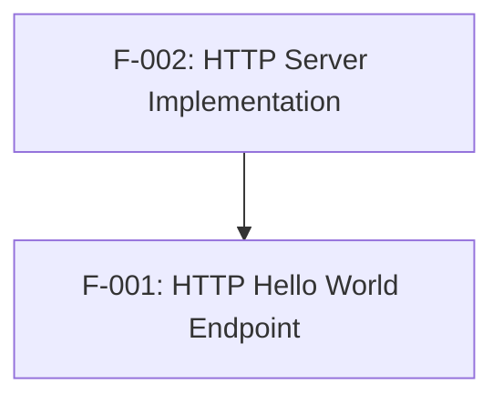
```mermaid
graph TD
    F002[F-002: HTTP Server Implementation] --> F001[F-001: HTTP Hello World Endpoint]
```

The HTTP Hello World Endpoint (F-001) depends on the HTTP Server Implementation (F-002) as the server must be operational before endpoints can process requests.

### 2.4 IMPLEMENTATION CONSIDERATIONS

#### F-001: HTTP Hello World Endpoint

| Consideration | Details |
|---------------|---------|
| Technical Constraints | Must use Node.js core HTTP module without external dependencies |
| Performance Requirements | Response time should be minimal with negligible latency |
| Scalability Considerations | None for this simple implementation |
| Security Implications | None for this basic endpoint |
| Maintenance Requirements | Code should be well-commented for educational purposes |

#### F-002: HTTP Server Implementation

| Consideration | Details |
|---------------|---------|
| Technical Constraints | Must use Node.js core HTTP module without external dependencies |
| Performance Requirements | Server should handle multiple concurrent requests efficiently |
| Scalability Considerations | None for this simple implementation |
| Security Implications | Basic error handling to prevent server crashes |
| Maintenance Requirements | Clear startup and shutdown procedures |

### 2.5 TRACEABILITY MATRIX

| Requirement ID | Feature ID | Feature Name | Priority | Status |
|----------------|------------|--------------|----------|--------|
| F-001-RQ-001 | F-001 | HTTP Hello World Endpoint | Must-Have | Approved |
| F-002-RQ-001 | F-002 | HTTP Server Implementation | Must-Have | Approved |
| F-002-RQ-002 | F-002 | HTTP Server Implementation | Should-Have | Approved |

## 3. TECHNOLOGY STACK

### 3.1 PROGRAMMING LANGUAGES

| Language | Component | Version | Justification |
|----------|-----------|---------|---------------|
| JavaScript | Server | ES6+ | Native language for Node.js runtime with excellent HTTP handling capabilities |
| Node.js | Runtime | 18.x LTS | Long-term support version offering stability and modern JavaScript features |

**Selection Criteria:**
- JavaScript is the native language for Node.js, providing a consistent development experience
- Node.js offers built-in HTTP modules that simplify server implementation without external dependencies
- Asynchronous, non-blocking I/O model makes Node.js ideal for lightweight HTTP services

### 3.2 FRAMEWORKS & LIBRARIES

| Framework/Library | Purpose | Version | Justification |
|-------------------|---------|---------|---------------|
| Node.js HTTP Module | Core HTTP server | Built-in | Native module eliminates external dependencies while providing all required functionality |

**Justification:**
- For a minimal Hello World application, the built-in HTTP module provides all necessary functionality
- Avoiding external web frameworks (Express, Koa, etc.) reduces complexity and dependencies
- Core HTTP module offers direct control over request/response handling with minimal abstraction

### 3.3 OPEN SOURCE DEPENDENCIES

| Dependency | Purpose | Version | Source |
|------------|---------|---------|--------|
| None | N/A | N/A | N/A |

**Justification:**
- The application requirements can be fully satisfied using Node.js core modules
- Eliminating external dependencies reduces security risks, simplifies maintenance, and minimizes build complexity
- Package.json will be used only for project metadata and scripts, not for managing dependencies

### 3.4 DEVELOPMENT & DEPLOYMENT

| Tool/Technology | Purpose | Version | Justification |
|-----------------|---------|---------|---------------|
| npm | Package management | Latest | Standard Node.js package manager for project initialization and script execution |
| nodemon | Development server | 2.0.x | Optional development dependency for automatic server restarts during development |
| Git | Version control | Latest | Industry standard version control system for source code management |

**Development Environment:**
- Local Node.js installation with minimal configuration requirements
- Simple command-line execution for server startup and testing
- No complex build process required due to interpreted nature of JavaScript

**Deployment Considerations:**
- Application can be deployed directly on any system with Node.js installed
- No containerization required for this minimal implementation, though Docker could be added if needed
- Simple process management (e.g., PM2) could be added for production deployments

### 3.5 TECHNOLOGY STACK DIAGRAM

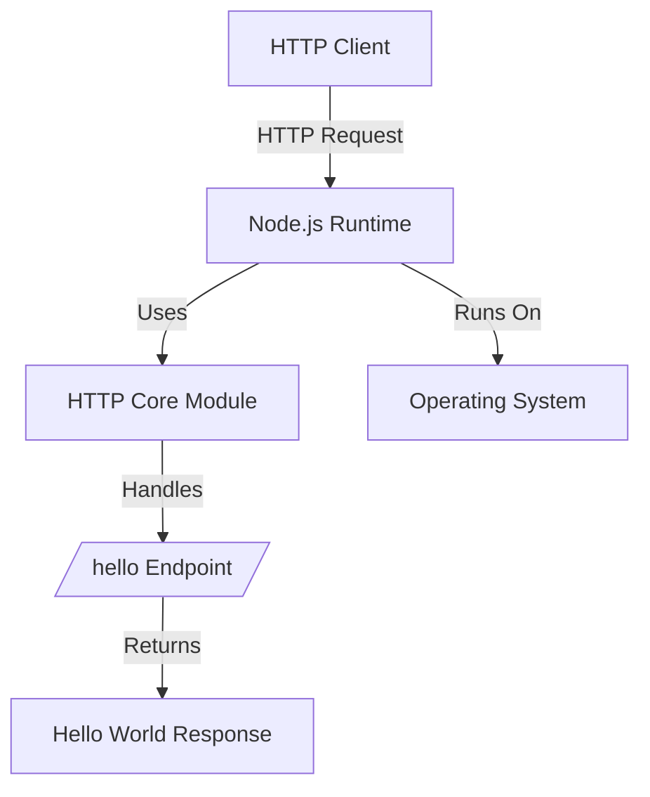
```mermaid
graph TD
    Client[HTTP Client] -->|HTTP Request| NodeJS[Node.js Runtime]
    NodeJS -->|Uses| HTTPModule[HTTP Core Module]
    HTTPModule -->|Handles| Endpoint[/"hello Endpoint"/]
    Endpoint -->|Returns| Response[Hello World Response]
    NodeJS -->|Runs On| OS[Operating System]
```

## 4. PROCESS FLOWCHART

### 4.1 SYSTEM WORKFLOWS

#### 4.1.1 Core Business Processes

##### HTTP Request Processing Workflow

```mermaid
flowchart TD
    Start([Client Initiates Request]) --> A[Client sends HTTP GET to /hello endpoint]
    A --> B[Node.js HTTP server receives request]
    B --> C{Valid endpoint?}
    C -->|Yes, /hello| D[Process /hello request]
    C -->|No| E[Generate 404 Not Found response]
    D --> F["Generate 200 OK response with \"Hello world\" text"]
    E --> G[Return error response to client]
    F --> H[Return success response to client]
    G --> End([Request Complete])
    H --> End
```

##### Server Lifecycle Workflow

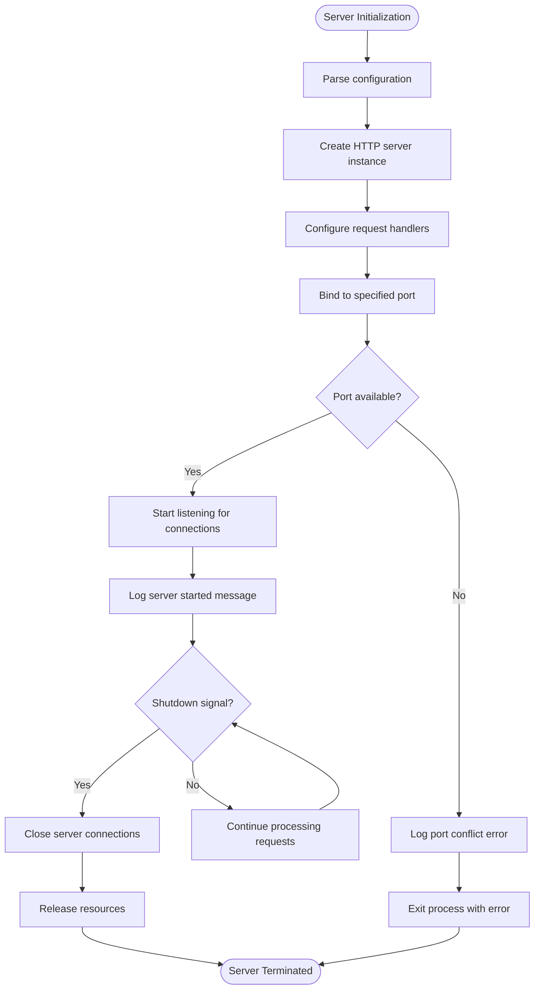
```mermaid
flowchart TD
    Start([Server Initialization]) --> A[Parse configuration]
    A --> B[Create HTTP server instance]
    B --> C[Configure request handlers]
    C --> D[Bind to specified port]
    D --> E{Port available?}
    E -->|Yes| F[Start listening for connections]
    E -->|No| G[Log port conflict error]
    F --> H[Log server started message]
    G --> I[Exit process with error]
    H --> J{Shutdown signal?}
    J -->|No| K[Continue processing requests]
    K --> J
    J -->|Yes| L[Close server connections]
    L --> M[Release resources]
    M --> End([Server Terminated])
    I --> End
```

#### 4.1.2 Integration Workflows

##### Client-Server Interaction Flow

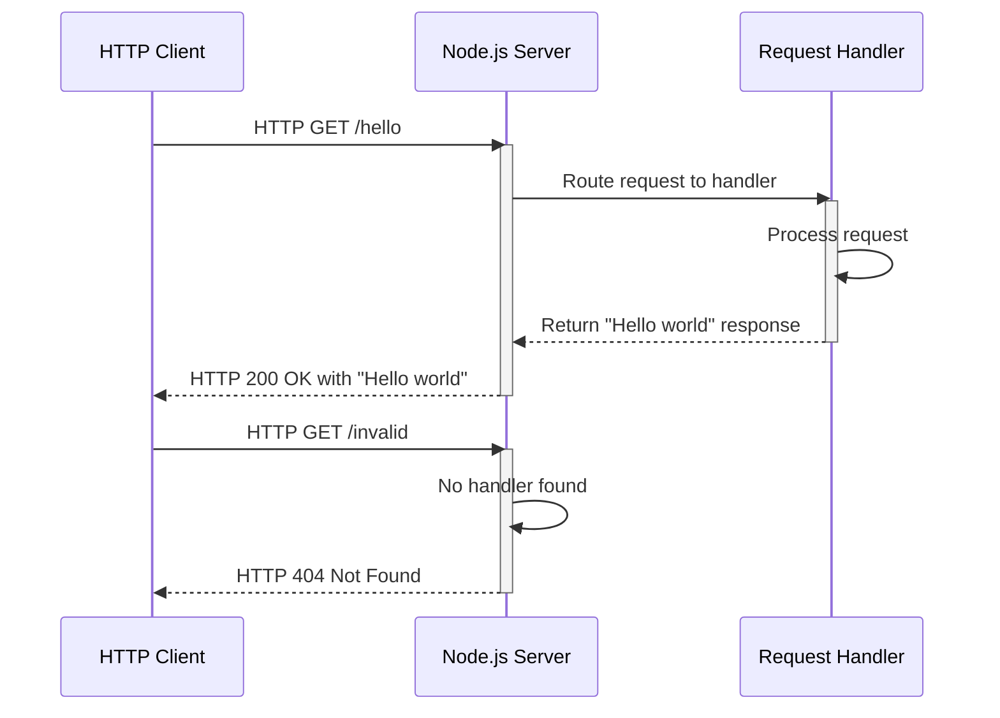
```mermaid
sequenceDiagram
    participant Client as HTTP Client
    participant Server as Node.js Server
    participant Handler as Request Handler
    
    Client->>Server: HTTP GET /hello
    activate Server
    Server->>Handler: Route request to handler
    activate Handler
    Handler->>Handler: Process request
    Handler-->>Server: Return "Hello world" response
    deactivate Handler
    Server-->>Client: HTTP 200 OK with "Hello world"
    deactivate Server
    
    Client->>Server: HTTP GET /invalid
    activate Server
    Server->>Server: No handler found
    Server-->>Client: HTTP 404 Not Found
    deactivate Server
```

### 4.2 FLOWCHART REQUIREMENTS

#### 4.2.1 Detailed Request Processing Flow

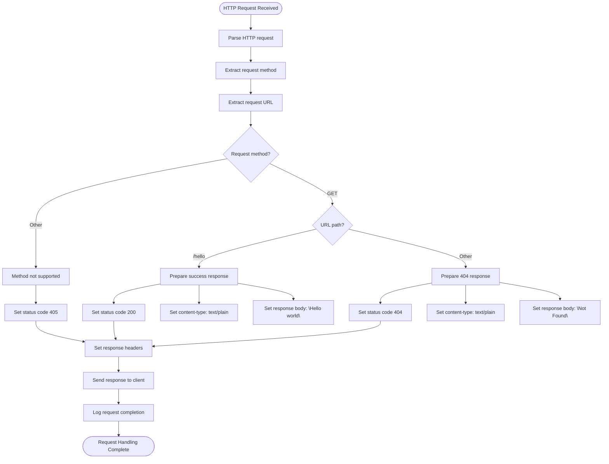
```mermaid
flowchart TD
    Start([HTTP Request Received]) --> A[Parse HTTP request]
    A --> B[Extract request method]
    B --> C[Extract request URL]
    C --> D{Request method?}
    D -->|GET| E{URL path?}
    D -->|Other| F[Method not supported]
    E -->|/hello| G[Prepare success response]
    E -->|Other| H[Prepare 404 response]
    F --> I[Set status code 405]
    G --> J[Set status code 200]
    G --> K[Set content-type: text/plain]
    G --> L["Set response body: \"Hello world\""]
    H --> M[Set status code 404]
    H --> N[Set content-type: text/plain]
    H --> O["Set response body: \"Not Found\""]
    I --> P[Set response headers]
    J --> P
    M --> P
    P --> Q[Send response to client]
    Q --> R[Log request completion]
    R --> End([Request Handling Complete])
```

#### 4.2.2 Error Handling Decision Flow

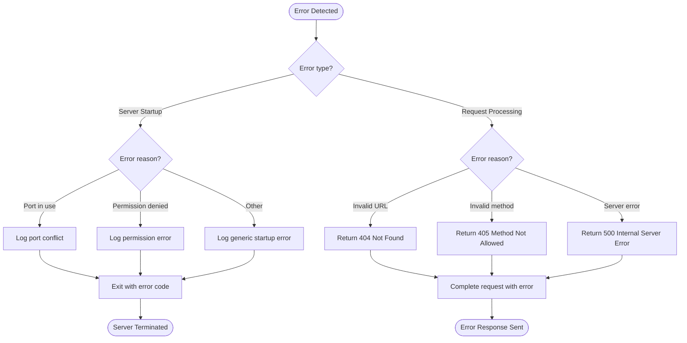
```mermaid
flowchart TD
    Start([Error Detected]) --> A{Error type?}
    A -->|Server Startup| B{Error reason?}
    A -->|Request Processing| C{Error reason?}
    B -->|Port in use| D[Log port conflict]
    B -->|Permission denied| E[Log permission error]
    B -->|Other| F[Log generic startup error]
    C -->|Invalid URL| G[Return 404 Not Found]
    C -->|Invalid method| H[Return 405 Method Not Allowed]
    C -->|Server error| I[Return 500 Internal Server Error]
    D --> J[Exit with error code]
    E --> J
    F --> J
    G --> K[Complete request with error]
    H --> K
    I --> K
    J --> End1([Server Terminated])
    K --> End2([Error Response Sent])
```

### 4.3 TECHNICAL IMPLEMENTATION

#### 4.3.1 State Management Flow

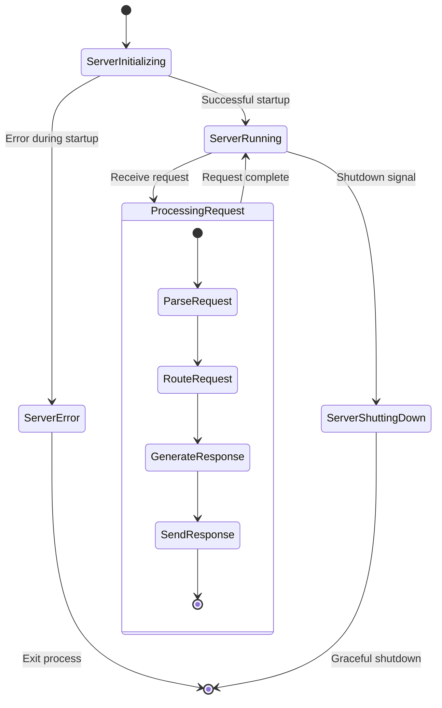
```mermaid
stateDiagram-v2
    [*] --> ServerInitializing
    ServerInitializing --> ServerRunning: Successful startup
    ServerInitializing --> ServerError: Error during startup
    ServerError --> [*]: Exit process
    
    ServerRunning --> ProcessingRequest: Receive request
    ProcessingRequest --> ServerRunning: Request complete
    
    ServerRunning --> ServerShuttingDown: Shutdown signal
    ServerShuttingDown --> [*]: Graceful shutdown
    
    state ProcessingRequest {
        [*] --> ParseRequest
        ParseRequest --> RouteRequest
        RouteRequest --> GenerateResponse
        GenerateResponse --> SendResponse
        SendResponse --> [*]
    }
```

#### 4.3.2 Error Handling Flow

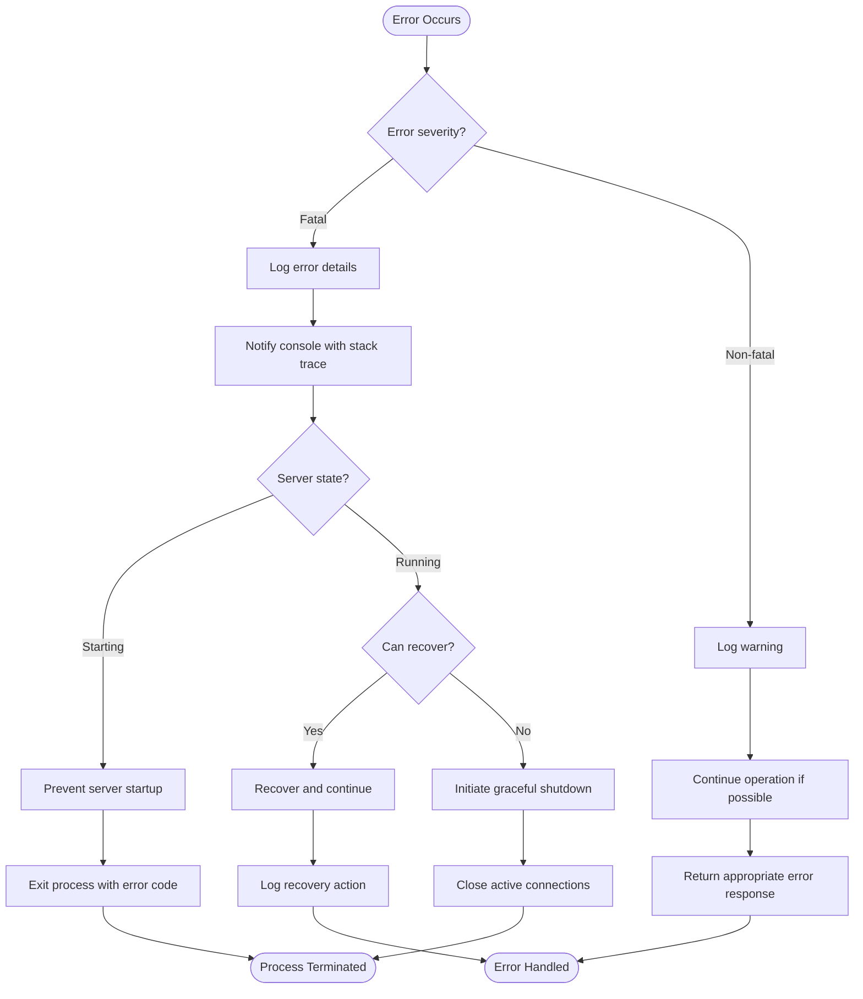
```mermaid
flowchart TD
    Start([Error Occurs]) --> A{Error severity?}
    A -->|Fatal| B[Log error details]
    A -->|Non-fatal| C[Log warning]
    B --> D[Notify console with stack trace]
    C --> E[Continue operation if possible]
    D --> F{Server state?}
    F -->|Starting| G[Prevent server startup]
    F -->|Running| H{Can recover?}
    G --> I[Exit process with error code]
    H -->|Yes| J[Recover and continue]
    H -->|No| K[Initiate graceful shutdown]
    E --> L[Return appropriate error response]
    J --> M[Log recovery action]
    K --> N[Close active connections]
    I --> End1([Process Terminated])
    L --> End2([Error Handled])
    M --> End2
    N --> End1
```

### 4.4 REQUIRED DIAGRAMS

#### 4.4.1 High-Level System Workflow

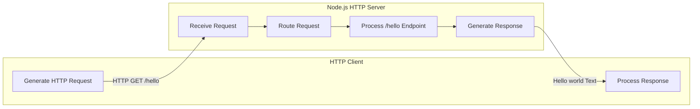
```mermaid
flowchart LR
    subgraph Client["HTTP Client"]
        A[Generate HTTP Request]
        Z[Process Response]
    end
    
    subgraph NodeServer["Node.js HTTP Server"]
        B[Receive Request]
        C[Route Request]
        D[Process /hello Endpoint]
        E[Generate Response]
    end
    
    A -->|HTTP GET /hello| B
    B --> C
    C --> D
    D --> E
    E -->|"Hello world" Text| Z
```

#### 4.4.2 Detailed Process Flow for Hello Endpoint

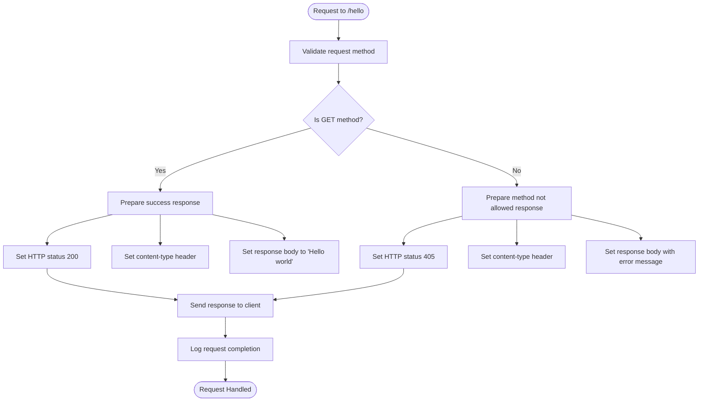
```mermaid
flowchart TD
    Start([Request to /hello]) --> A[Validate request method]
    A --> B{Is GET method?}
    B -->|Yes| C[Prepare success response]
    B -->|No| D[Prepare method not allowed response]
    C --> E[Set HTTP status 200]
    C --> F[Set content-type header]
    C --> G["Set response body to 'Hello world'"]
    D --> H[Set HTTP status 405]
    D --> I[Set content-type header]
    D --> J[Set response body with error message]
    E --> K[Send response to client]
    H --> K
    K --> L[Log request completion]
    L --> End([Request Handled])
```

#### 4.4.3 Error Handling Flowchart

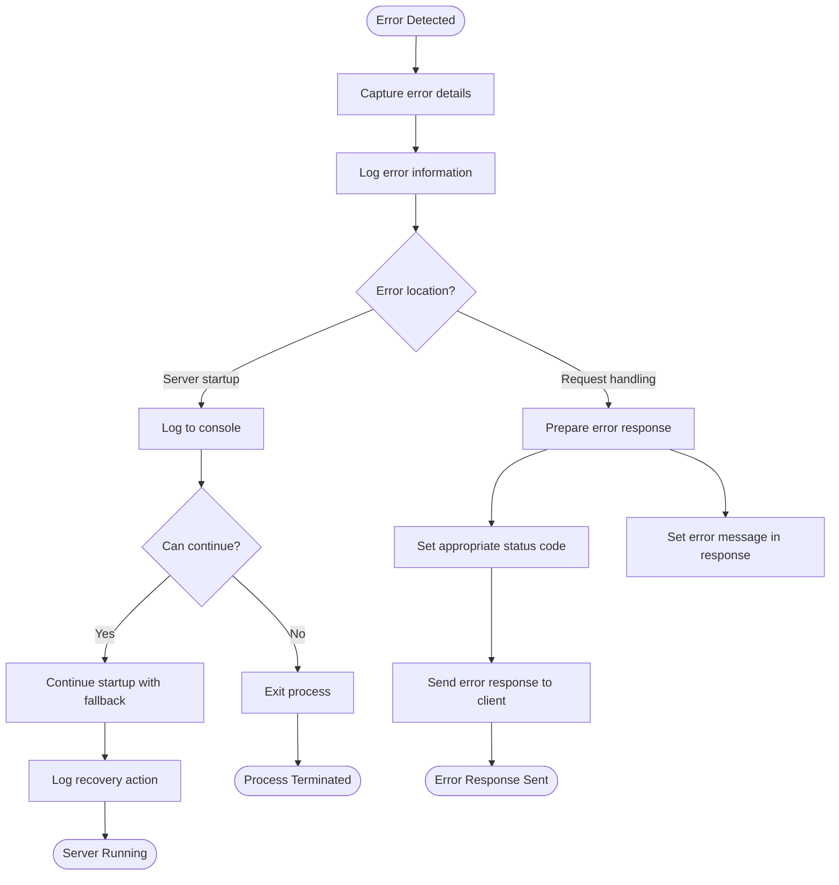
```mermaid
flowchart TD
    Start([Error Detected]) --> A[Capture error details]
    A --> B[Log error information]
    B --> C{Error location?}
    C -->|Server startup| D[Log to console]
    C -->|Request handling| E[Prepare error response]
    D --> F{Can continue?}
    F -->|Yes| G[Continue startup with fallback]
    F -->|No| H[Exit process]
    E --> I[Set appropriate status code]
    E --> J[Set error message in response]
    G --> K[Log recovery action]
    I --> L[Send error response to client]
    H --> End1([Process Terminated])
    K --> End2([Server Running])
    L --> End3([Error Response Sent])
```

#### 4.4.4 Integration Sequence Diagram

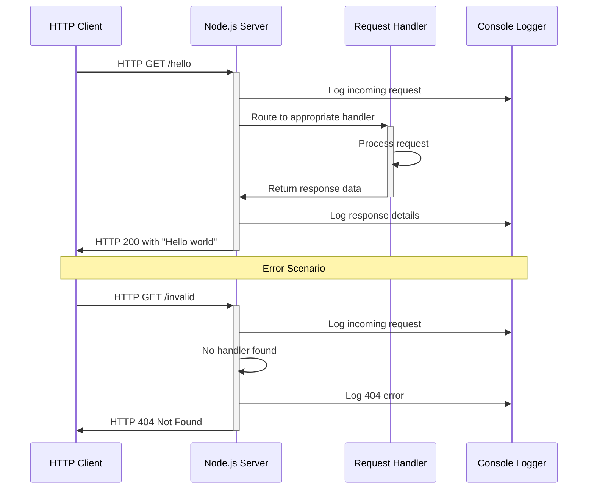
```mermaid
sequenceDiagram
    participant Client as HTTP Client
    participant Server as Node.js Server
    participant Handler as Request Handler
    participant Logger as Console Logger
    
    Client->>+Server: HTTP GET /hello
    Server->>Logger: Log incoming request
    Server->>+Handler: Route to appropriate handler
    Handler->>Handler: Process request
    Handler->>-Server: Return response data
    Server->>Logger: Log response details
    Server->>-Client: HTTP 200 with "Hello world"
    
    Note over Client,Logger: Error Scenario
    
    Client->>+Server: HTTP GET /invalid
    Server->>Logger: Log incoming request
    Server->>Server: No handler found
    Server->>Logger: Log 404 error
    Server->>-Client: HTTP 404 Not Found
```

#### 4.4.5 State Transition Diagram

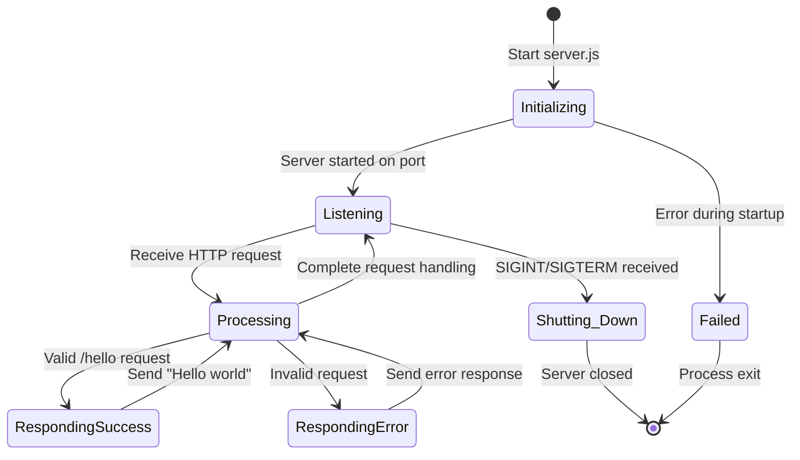
```mermaid
stateDiagram-v2
    [*] --> Initializing: Start server.js
    
    Initializing --> Listening: Server started on port
    Initializing --> Failed: Error during startup
    
    Listening --> Processing: Receive HTTP request
    Processing --> Listening: Complete request handling
    
    Processing --> RespondingSuccess: Valid /hello request
    Processing --> RespondingError: Invalid request
    
    RespondingSuccess --> Processing: Send "Hello world"
    RespondingError --> Processing: Send error response
    
    Listening --> Shutting_Down: SIGINT/SIGTERM received
    Shutting_Down --> [*]: Server closed
    
    Failed --> [*]: Process exit
```

## 5. SYSTEM ARCHITECTURE

### 5.1 HIGH-LEVEL ARCHITECTURE

#### 5.1.1 System Overview

The Node.js Hello World service follows a simple monolithic architecture pattern, appropriate for its minimal requirements. The system employs:

- **Single-Process Architecture**: A standalone Node.js process handles all HTTP requests without distribution across multiple services.
- **Request-Response Pattern**: The system follows a synchronous request-response pattern for handling HTTP interactions.
- **Core Module Utilization**: The architecture leverages Node.js built-in HTTP module to minimize dependencies.

Key architectural principles include:

- **Simplicity**: Minimizing complexity by using only essential components
- **Statelessness**: No session or state management between requests
- **Self-Containment**: No external dependencies beyond Node.js core modules

System boundaries are clearly defined with a single HTTP interface exposed to clients. The system does not integrate with external services, databases, or other components.

#### 5.1.2 Core Components Table

| Component Name | Primary Responsibility | Key Dependencies | Critical Considerations |
|----------------|------------------------|------------------|-------------------------|
| HTTP Server | Listen for incoming connections and manage server lifecycle | Node.js HTTP module | Port configuration, error handling during startup |
| Request Router | Direct incoming requests to appropriate handlers based on URL path | HTTP Server | URL path parsing, method validation |
| Hello Endpoint Handler | Process requests to `/hello` path and generate responses | Request Router | Response formatting, status code selection |
| Error Handler | Manage error conditions and generate appropriate error responses | All components | Consistent error formatting, proper HTTP status codes |

#### 5.1.3 Data Flow Description

The data flow in this system is straightforward and unidirectional:

1. HTTP clients send requests to the Node.js server on the configured port
2. The HTTP Server component receives and parses the raw HTTP request
3. The Request Router examines the URL path and HTTP method to determine the appropriate handler
4. For `/hello` path requests, the Hello Endpoint Handler processes the request
5. The handler generates a response containing "Hello world" text with appropriate headers
6. The HTTP Server sends the response back to the client

No data persistence occurs within the system. All processing happens in-memory without data transformation or storage requirements. The system maintains no state between requests, operating in a purely stateless manner.

#### 5.1.4 External Integration Points

| System Name | Integration Type | Data Exchange Pattern | Protocol/Format |
|-------------|------------------|------------------------|-----------------|
| HTTP Clients | Inbound | Request-Response | HTTP/Plain Text |

### 5.2 COMPONENT DETAILS

#### 5.2.1 HTTP Server Component

- **Purpose**: Initializes and manages the HTTP server, listening for incoming connections on a configured port
- **Responsibilities**:
  - Server lifecycle management (startup, shutdown)
  - Connection acceptance and request parsing
  - Response transmission
  - Error handling for server-level issues
- **Technologies**: Node.js HTTP module
- **Key Interfaces**:
  - `createServer()`: Creates HTTP server instance
  - `listen()`: Binds server to specified port
  - `close()`: Gracefully shuts down server
- **Scaling Considerations**: Single-instance design appropriate for demonstration purposes

#### 5.2.2 Request Router Component

- **Purpose**: Routes incoming HTTP requests to appropriate handlers based on URL path
- **Responsibilities**:
  - URL path parsing and validation
  - HTTP method validation
  - Handler dispatch based on routing rules
  - 404 handling for undefined routes
- **Technologies**: Node.js URL module, custom routing logic
- **Key Interfaces**:
  - Request handler function receiving (req, res) parameters
- **Scaling Considerations**: Simple path-based routing sufficient for single endpoint

#### 5.2.3 Hello Endpoint Handler

- **Purpose**: Processes requests to the `/hello` endpoint and generates responses
- **Responsibilities**:
  - Validates request method (GET supported)
  - Generates "Hello world" response text
  - Sets appropriate HTTP headers
  - Returns response to client
- **Technologies**: Node.js HTTP response methods
- **Key Interfaces**:
  - Handler function receiving (req, res) parameters
- **Scaling Considerations**: Stateless design supports horizontal scaling if needed

#### 5.2.4 Error Handler Component

- **Purpose**: Manages error conditions and generates appropriate error responses
- **Responsibilities**:
  - Captures and logs errors
  - Formats error responses with appropriate status codes
  - Prevents server crashes from unhandled exceptions
- **Technologies**: Node.js error handling patterns
- **Key Interfaces**:
  - Error handling middleware or functions
- **Scaling Considerations**: Centralized error handling simplifies maintenance

#### 5.2.5 Component Interaction Diagram

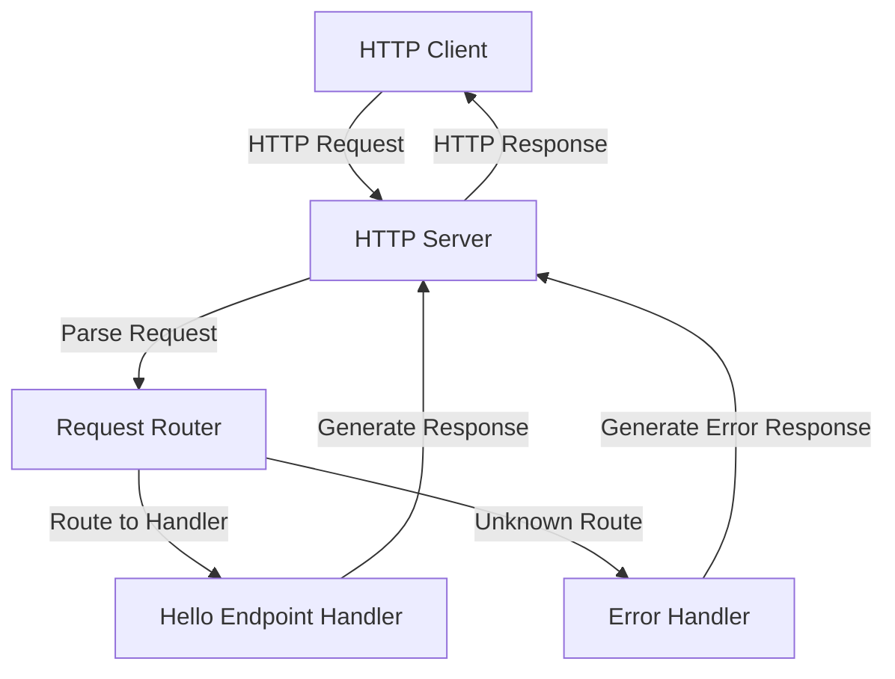
```mermaid
graph TD
    Client[HTTP Client] -->|HTTP Request| Server[HTTP Server]
    Server -->|Parse Request| Router[Request Router]
    Router -->|Route to Handler| HelloHandler[Hello Endpoint Handler]
    Router -->|Unknown Route| ErrorHandler[Error Handler]
    HelloHandler -->|Generate Response| Server
    ErrorHandler -->|Generate Error Response| Server
    Server -->|HTTP Response| Client
```

#### 5.2.6 Request Processing Sequence Diagram

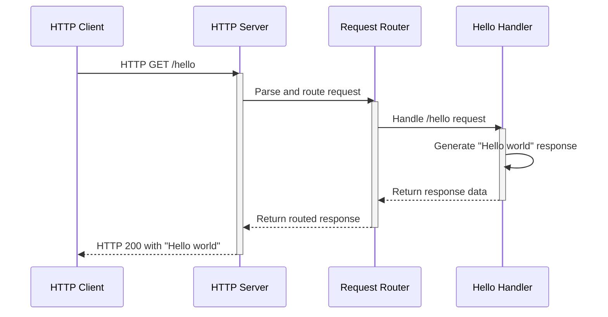
```mermaid
sequenceDiagram
    participant Client as HTTP Client
    participant Server as HTTP Server
    participant Router as Request Router
    participant Handler as Hello Handler
    
    Client->>Server: HTTP GET /hello
    activate Server
    Server->>Router: Parse and route request
    activate Router
    Router->>Handler: Handle /hello request
    activate Handler
    Handler->>Handler: Generate "Hello world" response
    Handler-->>Router: Return response data
    deactivate Handler
    Router-->>Server: Return routed response
    deactivate Router
    Server-->>Client: HTTP 200 with "Hello world"
    deactivate Server
```

#### 5.2.7 Error Handling State Diagram

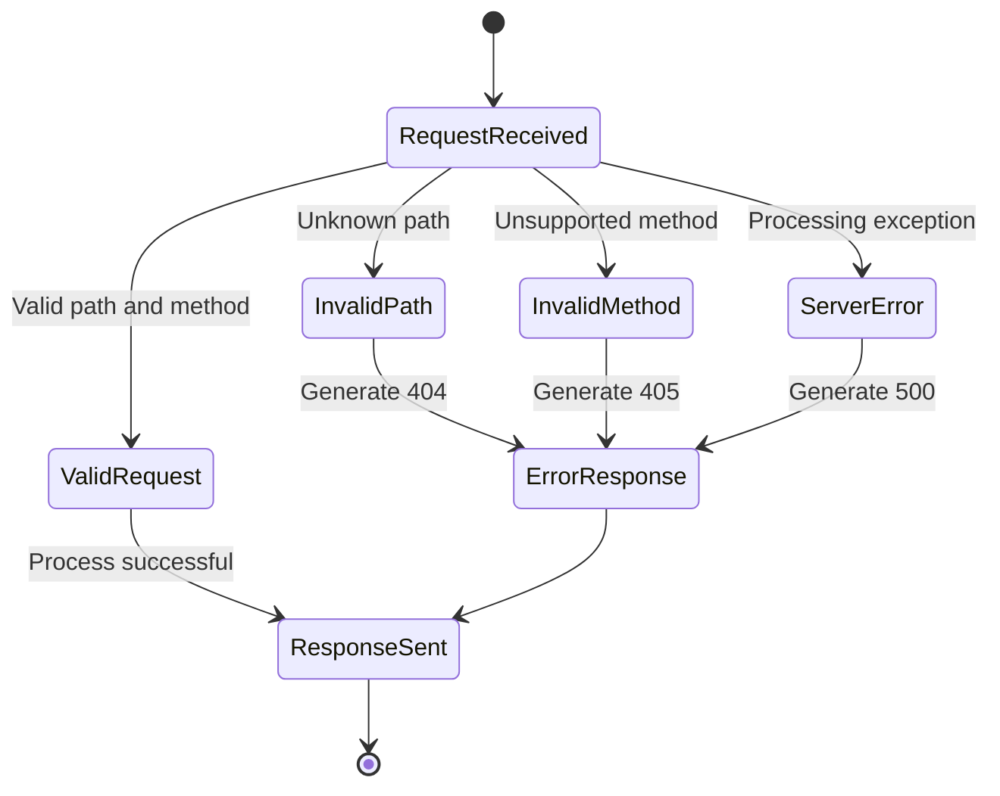
```mermaid
stateDiagram-v2
    [*] --> RequestReceived
    RequestReceived --> ValidRequest: Valid path and method
    RequestReceived --> InvalidPath: Unknown path
    RequestReceived --> InvalidMethod: Unsupported method
    RequestReceived --> ServerError: Processing exception
    
    ValidRequest --> ResponseSent: Process successful
    InvalidPath --> ErrorResponse: Generate 404
    InvalidMethod --> ErrorResponse: Generate 405
    ServerError --> ErrorResponse: Generate 500
    
    ErrorResponse --> ResponseSent
    ResponseSent --> [*]
```

### 5.3 TECHNICAL DECISIONS

#### 5.3.1 Architecture Style Decisions

| Decision | Selected Approach | Alternatives Considered | Rationale |
|----------|-------------------|-------------------------|-----------|
| Overall Architecture | Monolithic | Microservices, Serverless | Simplicity and minimal requirements make a monolithic approach most appropriate |
| Server Implementation | Node.js HTTP Module | Express.js, Koa.js, Fastify | Core HTTP module provides all needed functionality without additional dependencies |
| Request Handling | Synchronous | Async/Event-driven | Simple request processing doesn't require complex asynchronous patterns |
| Error Management | Centralized Handler | Try-catch blocks, Domain module | Centralized approach provides consistent error responses with minimal code duplication |

#### 5.3.2 Communication Pattern Decisions

| Pattern | Application | Rationale |
|---------|-------------|-----------|
| Request-Response | All client interactions | Standard HTTP pattern appropriate for simple API endpoint |
| Synchronous Processing | Request handling | Minimal processing requirements don't benefit from asynchronous patterns |
| Plain Text Responses | API responses | Simplest format for "Hello world" message without unnecessary complexity |
| HTTP Status Codes | Error communication | Standard approach for communicating success/failure conditions |

#### 5.3.3 Architecture Decision Record Diagram

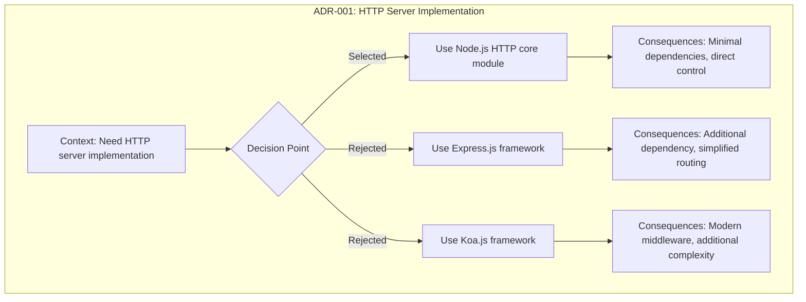
```mermaid
graph TD
    subgraph "ADR-001: HTTP Server Implementation"
        A[Context: Need HTTP server implementation] --> B{Decision Point}
        B -->|Selected| C[Use Node.js HTTP core module]
        B -->|Rejected| D[Use Express.js framework]
        B -->|Rejected| E[Use Koa.js framework]
        C --> F[Consequences: Minimal dependencies, direct control]
        D --> G[Consequences: Additional dependency, simplified routing]
        E --> H[Consequences: Modern middleware, additional complexity]
    end
```

### 5.4 CROSS-CUTTING CONCERNS

#### 5.4.1 Monitoring and Observability

For this minimal application, monitoring is limited to basic console logging:

- Server startup and shutdown events
- Incoming request details (method, path)
- Response status codes and timing
- Error conditions with stack traces

More sophisticated monitoring could be added for production use but is not required for the demonstration purpose.

#### 5.4.2 Logging Strategy

| Log Type | Implementation | Purpose |
|----------|----------------|---------|
| Startup Logs | Console output | Record server initialization and configuration |
| Request Logs | Console output | Track incoming requests with method and path |
| Error Logs | Console error | Capture and report error conditions |
| Shutdown Logs | Console output | Record graceful shutdown process |

#### 5.4.3 Error Handling Patterns

The system implements a simple but effective error handling approach:

- **Route-level errors**: 404 for unknown paths, 405 for unsupported methods
- **Server-level errors**: Graceful handling of startup failures (e.g., port conflicts)
- **Runtime exceptions**: Try-catch blocks to prevent server crashes

#### 5.4.4 Error Handling Flow Diagram

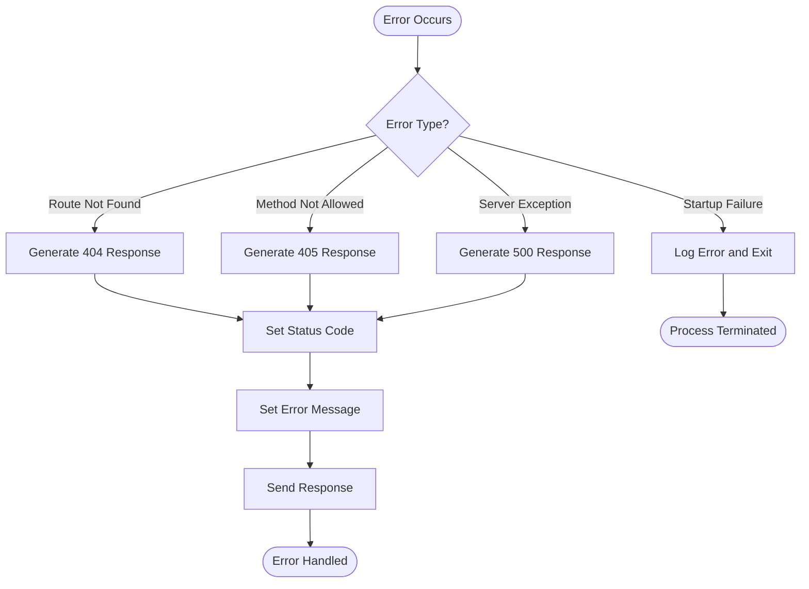
```mermaid
flowchart TD
    Start([Error Occurs]) --> A{Error Type?}
    A -->|Route Not Found| B[Generate 404 Response]
    A -->|Method Not Allowed| C[Generate 405 Response]
    A -->|Server Exception| D[Generate 500 Response]
    A -->|Startup Failure| E[Log Error and Exit]
    
    B --> F[Set Status Code]
    C --> F
    D --> F
    
    F --> G[Set Error Message]
    G --> H[Send Response]
    H --> End([Error Handled])
    
    E --> End2([Process Terminated])
```

#### 5.4.5 Performance Requirements

| Metric | Requirement | Implementation Approach |
|--------|-------------|-------------------------|
| Response Time | < 100ms | Minimal processing logic ensures fast responses |
| Throughput | Support multiple concurrent requests | Node.js event loop handles concurrent connections efficiently |
| Startup Time | < 1 second | No initialization dependencies or complex setup |
| Resource Usage | Minimal memory footprint | No in-memory caching or state management |

## 6. SYSTEM COMPONENTS DESIGN

### 6.1 COMPONENT SPECIFICATIONS

#### 6.1.1 HTTP Server Component

| Attribute | Specification |
|-----------|---------------|
| Component Name | HTTP Server |
| Component Type | Core Infrastructure |
| Description | Manages HTTP server lifecycle and request handling |
| Responsibilities | - Initialize HTTP server<br>- Listen on configured port<br>- Accept incoming connections<br>- Route requests to appropriate handlers<br>- Send responses to clients<br>- Handle server shutdown |
| Interfaces | - `createServer(requestListener)`: Creates HTTP server instance<br>- `listen(port)`: Binds server to specified port<br>- `close()`: Gracefully terminates server |
| Dependencies | Node.js HTTP module |
| Configuration Parameters | - PORT: Server listening port (default: 3000) |
| Error Handling | - Port binding errors<br>- Server initialization failures<br>- Graceful shutdown on process termination signals |

#### 6.1.2 Request Router Component

| Attribute | Specification |
|-----------|---------------|
| Component Name | Request Router |
| Component Type | Request Processing |
| Description | Routes incoming HTTP requests to appropriate handlers based on URL path |
| Responsibilities | - Parse request URL<br>- Match URL path to registered handlers<br>- Invoke appropriate handler for matched routes<br>- Return 404 for unmatched routes |
| Interfaces | - `handleRequest(req, res)`: Main request processing function |
| Dependencies | HTTP Server component |
| Configuration Parameters | None |
| Error Handling | - Invalid URL handling<br>- Route matching errors<br>- 404 generation for unknown paths |

#### 6.1.3 Hello Endpoint Handler

| Attribute | Specification |
|-----------|---------------|
| Component Name | Hello Endpoint Handler |
| Component Type | Request Handler |
| Description | Processes requests to the `/hello` endpoint and generates responses |
| Responsibilities | - Validate request method<br>- Generate "Hello world" response<br>- Set appropriate HTTP headers<br>- Return response to client |
| Interfaces | - `handleHelloRequest(req, res)`: Processes `/hello` requests |
| Dependencies | Request Router component |
| Configuration Parameters | None |
| Error Handling | - Method validation (405 for non-GET requests) |

#### 6.1.4 Error Handler Component

| Attribute | Specification |
|-----------|---------------|
| Component Name | Error Handler |
| Component Type | Cross-cutting Concern |
| Description | Manages error conditions and generates appropriate error responses |
| Responsibilities | - Capture and log errors<br>- Format error responses with appropriate status codes<br>- Prevent server crashes from unhandled exceptions |
| Interfaces | - `handleError(err, req, res)`: Processes errors and generates responses<br>- `handleNotFound(req, res)`: Generates 404 responses |
| Dependencies | All other components |
| Configuration Parameters | None |
| Error Handling | - Server-level error handling<br>- Unhandled exception capture |

### 6.2 COMPONENT INTERACTIONS

#### 6.2.1 Component Interaction Diagram

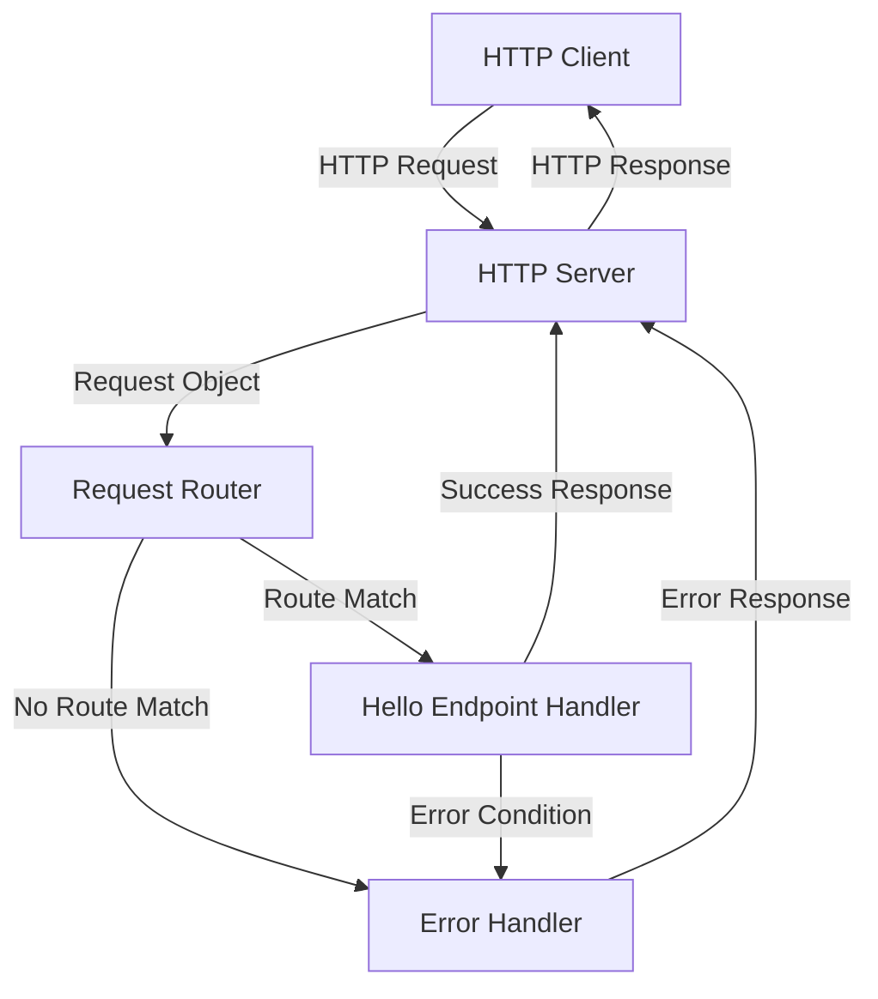
```mermaid
graph TD
    Client[HTTP Client] -->|HTTP Request| Server[HTTP Server]
    Server -->|Request Object| Router[Request Router]
    Router -->|Route Match| HelloHandler[Hello Endpoint Handler]
    Router -->|No Route Match| ErrorHandler[Error Handler]
    HelloHandler -->|Success Response| Server
    HelloHandler -->|Error Condition| ErrorHandler
    ErrorHandler -->|Error Response| Server
    Server -->|HTTP Response| Client
```

#### 6.2.2 Request Processing Sequence

```mermaid
sequenceDiagram
    participant Client as HTTP Client
    participant Server as HTTP Server
    participant Router as Request Router
    participant Handler as Hello Handler
    participant ErrorHandler as Error Handler
    
    Client->>+Server: HTTP GET /hello
    Server->>+Router: Route request
    Router->>+Handler: Process /hello request
    Handler-->>-Router: Return response data
    Router-->>-Server: Forward response
    Server-->>-Client: HTTP 200 with "Hello world"
    
    Client->>+Server: HTTP GET /unknown
    Server->>+Router: Route request
    Router->>+ErrorHandler: No route match
    ErrorHandler-->>-Router: 404 Not Found response
    Router-->>-Server: Forward error response
    Server-->>-Client: HTTP 404 Not Found
    
    Client->>+Server: HTTP POST /hello
    Server->>+Router: Route request
    Router->>+Handler: Process /hello request
    Handler->>+ErrorHandler: Method not allowed
    ErrorHandler-->>-Handler: 405 Method Not Allowed
    Handler-->>-Router: Forward error response
    Router-->>-Server: Forward error response
    Server-->>-Client: HTTP 405 Method Not Allowed
```

#### 6.2.3 Component Communication Patterns

| Communication Path | Pattern | Description |
|--------------------|---------|-------------|
| Client → HTTP Server | Request-Response | Synchronous HTTP request and response cycle |
| HTTP Server → Request Router | Function Call | Direct function invocation with request and response objects |
| Request Router → Hello Handler | Function Call | Direct function invocation for matched routes |
| Request Router → Error Handler | Function Call | Direct function invocation for error conditions |
| Hello Handler → Error Handler | Function Call | Direct function invocation for handler-level errors |
| All Components → Console | Logging | One-way message output for monitoring and debugging |

### 6.3 COMPONENT DESIGN DETAILS

#### 6.3.1 HTTP Server Component Design

The HTTP Server component serves as the entry point for the application, managing the HTTP server lifecycle and initial request handling.

**Key Design Elements:**
- Uses Node.js built-in `http` module to create server instance
- Configurable port with environment variable override and default fallback
- Graceful shutdown handling for SIGINT and SIGTERM signals
- Basic error handling for server startup issues

**Initialization Flow:**

```mermaid
flowchart TD
    Start([Server Start]) --> A[Import required modules]
    A --> B[Define request handler function]
    B --> C[Create HTTP server instance]
    C --> D[Define port configuration]
    D --> E[Start listening on port]
    E --> F{Server started?}
    F -->|Yes| G[Log successful startup]
    F -->|No| H[Log startup error]
    G --> I[Register shutdown handlers]
    H --> J[Exit process with error]
    I --> End([Server Running])
    J --> End2([Process Terminated])
```

#### 6.3.2 Request Router Component Design

The Request Router component analyzes incoming requests and directs them to the appropriate handler based on the URL path.

**Key Design Elements:**
- Simple path-based routing without complex pattern matching
- Support for HTTP method validation
- Direct mapping of paths to handler functions
- Default handler for unmatched routes (404)

**Routing Logic:**

```mermaid
flowchart TD
    Start([Request Received]) --> A[Parse URL path]
    A --> B{Path equals /hello?}
    B -->|Yes| C{Method is GET?}
    B -->|No| D[Invoke Not Found handler]
    C -->|Yes| E[Invoke Hello handler]
    C -->|No| F[Invoke Method Not Allowed handler]
    D --> End([Response Generated])
    E --> End
    F --> End
```

#### 6.3.3 Hello Endpoint Handler Design

The Hello Endpoint Handler processes requests to the `/hello` path and generates the "Hello world" response.

**Key Design Elements:**
- Validates HTTP method (supports GET only)
- Sets appropriate content type header
- Generates plain text response with "Hello world" message
- Returns 200 OK status for successful requests

**Handler Logic:**

```mermaid
flowchart TD
    Start([Hello Request]) --> A{Method is GET?}
    A -->|Yes| B[Set status code 200]
    A -->|No| C[Set status code 405]
    B --> D[Set content-type: text/plain]
    C --> E[Set content-type: text/plain]
    D --> F["Set body: 'Hello world'"]
    E --> G["Set body: 'Method Not Allowed'"]
    F --> H[End response]
    G --> H
    H --> End([Response Complete])
```

#### 6.3.4 Error Handler Component Design

The Error Handler component manages error conditions and generates appropriate error responses.

**Key Design Elements:**
- Centralized error handling logic
- Consistent error response format
- Appropriate HTTP status codes for different error types
- Error logging for debugging and monitoring

**Error Handling Logic:**

```mermaid
flowchart TD
    Start([Error Detected]) --> A{Error type?}
    A -->|Not Found| B[Set status code 404]
    A -->|Method Not Allowed| C[Set status code 405]
    A -->|Server Error| D[Set status code 500]
    B --> E[Set content-type header]
    C --> E
    D --> E
    E --> F[Set appropriate error message]
    F --> G[Log error details]
    G --> H[End response with error]
    H --> End([Error Response Sent])
```

### 6.4 INTERFACE SPECIFICATIONS

#### 6.4.1 HTTP API Specification

| Endpoint | Method | Description | Request Parameters | Response Format | Status Codes |
|----------|--------|-------------|-------------------|-----------------|--------------|
| `/hello` | GET | Returns "Hello world" text | None | Plain text | 200 OK, 405 Method Not Allowed |
| Any other path | Any | Returns not found error | None | Plain text | 404 Not Found |

**Request Example:**
```
GET /hello HTTP/1.1
Host: localhost:3000
```

**Success Response Example:**
```
HTTP/1.1 200 OK
Content-Type: text/plain
Content-Length: 11

Hello world
```

**Error Response Example:**
```
HTTP/1.1 404 Not Found
Content-Type: text/plain
Content-Length: 9

Not Found
```

#### 6.4.2 Internal Component Interfaces

| Interface | Signature | Description | Parameters | Return Value |
|-----------|-----------|-------------|------------|--------------|
| HTTP Server Request Listener | `(req, res) => void` | Main request handler function | req: HTTP request object<br>res: HTTP response object | None (side effect: response sent) |
| Request Router | `routeRequest(req, res)` | Routes requests to handlers | req: HTTP request object<br>res: HTTP response object | None (side effect: response sent) |
| Hello Handler | `handleHello(req, res)` | Processes /hello requests | req: HTTP request object<br>res: HTTP response object | None (side effect: response sent) |
| Error Handler | `handleError(err, req, res)` | Processes error conditions | err: Error object<br>req: HTTP request object<br>res: HTTP response object | None (side effect: response sent) |

### 6.5 COMPONENT STATE MANAGEMENT

#### 6.5.1 State Management Approach

The application follows a stateless design pattern, with no persistent state maintained between requests. This approach:

- Simplifies the implementation
- Eliminates concurrency concerns
- Supports horizontal scaling if needed
- Reduces memory usage

#### 6.5.2 Server Lifecycle States

```mermaid
stateDiagram-v2
    [*] --> Initializing
    Initializing --> Running: Server started
    Initializing --> Failed: Error during startup
    Running --> ShuttingDown: SIGINT/SIGTERM received
    ShuttingDown --> [*]: Server closed
    Failed --> [*]: Process terminated
```

#### 6.5.3 Request Processing States

```mermaid
stateDiagram-v2
    [*] --> Receiving
    Receiving --> Routing: Request received
    Routing --> Processing: Route matched
    Routing --> Erroring: Route not found
    Processing --> Responding: Processing complete
    Processing --> Erroring: Processing error
    Erroring --> Responding: Error response prepared
    Responding --> [*]: Response sent
```

### 6.6 COMPONENT CONFIGURATION

#### 6.6.1 Configuration Parameters

| Parameter | Description | Default Value | Source | Validation Rules |
|-----------|-------------|---------------|--------|------------------|
| PORT | HTTP server listening port | 3000 | Environment variable | Integer between 1-65535 |
| NODE_ENV | Runtime environment | 'development' | Environment variable | String: 'development', 'production', 'test' |

#### 6.6.2 Configuration Loading Process

```mermaid
flowchart TD
    Start([Configuration Loading]) --> A[Load environment variables]
    A --> B[Set PORT from environment or default]
    B --> C[Validate PORT value]
    C --> D{PORT valid?}
    D -->|Yes| E[Apply configuration]
    D -->|No| F[Log validation error]
    F --> G[Use default PORT value]
    G --> E
    E --> End([Configuration Complete])
```

### 6.7 ERROR HANDLING STRATEGY

#### 6.7.1 Error Categories

| Error Category | Description | Handling Approach | Response Code |
|----------------|-------------|-------------------|---------------|
| Route Not Found | Request to undefined endpoint | Return standard 404 response | 404 Not Found |
| Method Not Allowed | Unsupported HTTP method | Return standard 405 response | 405 Method Not Allowed |
| Server Error | Unexpected runtime error | Log error and return generic error response | 500 Internal Server Error |
| Startup Error | Error during server initialization | Log error and terminate process | N/A (process exit) |

#### 6.7.2 Error Response Format

All error responses follow a consistent plain text format:

```
HTTP/1.1 {STATUS_CODE} {STATUS_TEXT}
Content-Type: text/plain
Content-Length: {LENGTH}

{ERROR_MESSAGE}
```

#### 6.7.3 Error Logging Strategy

| Error Type | Log Level | Information Included | Destination |
|------------|-----------|----------------------|-------------|
| Route Not Found | Info | Request method, path, timestamp | Console |
| Method Not Allowed | Warning | Request method, path, timestamp | Console |
| Server Error | Error | Error message, stack trace, request details | Console |
| Startup Error | Fatal | Error message, stack trace | Console |

## 6.1 CORE SERVICES ARCHITECTURE

For this Node.js Hello World application, a traditional microservices or distributed architecture is not applicable. The system is intentionally designed as a simple monolithic application to demonstrate fundamental HTTP server concepts with minimal complexity.

### 6.1.1 ARCHITECTURE JUSTIFICATION

| Consideration | Rationale |
|---------------|-----------|
| System Complexity | The application has a single responsibility (serving "Hello world") that doesn't warrant service decomposition |
| Development Overhead | Microservices introduce unnecessary complexity for this educational example |
| Operational Simplicity | A monolithic design allows for easier deployment and maintenance |
| Resource Efficiency | A single process is more resource-efficient for this minimal functionality |

While distributed architectures provide benefits for complex systems, they introduce overhead that would be counterproductive for this simple application. The system can be fully described as a single-service monolith with the following characteristics:

### 6.1.2 SIMPLIFIED SERVICE ARCHITECTURE

```mermaid
graph TD
    Client[HTTP Client] -->|HTTP Request| NodeServer[Node.js HTTP Server]
    NodeServer -->|Process Request| Handler[Hello Endpoint Handler]
    Handler -->|Generate Response| NodeServer
    NodeServer -->|HTTP Response| Client
```

### 6.1.3 SCALABILITY CONSIDERATIONS

Although the application doesn't require a distributed architecture, basic scalability can still be addressed:

| Scaling Approach | Implementation |
|------------------|----------------|
| Horizontal Scaling | Multiple instances behind a load balancer if needed |
| Process Management | PM2 or similar tool for process monitoring and restart |
| Resource Optimization | Minimal memory footprint with efficient request handling |

```mermaid
graph TD
    Client[HTTP Clients] -->|Requests| LB[Load Balancer]
    LB -->|Route Request| Instance1[Node.js Instance 1]
    LB -->|Route Request| Instance2[Node.js Instance 2]
    LB -->|Route Request| InstanceN[Node.js Instance N]
```

### 6.1.4 RESILIENCE APPROACH

For this simple application, resilience is addressed through basic mechanisms:

| Resilience Aspect | Implementation |
|-------------------|----------------|
| Process Recovery | Automatic restart on crash (via process manager) |
| Error Handling | Proper exception handling to prevent crashes |
| Graceful Shutdown | Signal handling for clean termination |

```mermaid
stateDiagram-v2
    [*] --> Running
    Running --> Failed: Uncaught Exception
    Failed --> Restarting: Process Manager Detects
    Restarting --> Running: Restart Complete
    Running --> ShuttingDown: SIGTERM/SIGINT
    ShuttingDown --> [*]: Clean Termination
```

### 6.1.5 FUTURE ARCHITECTURE EVOLUTION

If the application were to grow in complexity, a more sophisticated architecture could be considered:

| Evolution Stage | Architectural Changes |
|-----------------|----------------------|
| Basic Scaling | Multiple instances with load balancing |
| API Gateway | Add routing layer for multiple endpoints |
| Service Decomposition | Split functionality into microservices when justified |
| Containerization | Docker deployment for consistent environments |

The current monolithic design provides a foundation that can evolve as requirements grow, without introducing premature architectural complexity.

### 6.2 DATABASE DESIGN

Database design is not applicable to this system. The Node.js Hello World application with a single `/hello` endpoint that returns "Hello world" does not require any persistent data storage for the following reasons:

#### Justification for No Database Requirement

| Reason | Explanation |
|--------|-------------|
| Stateless Operation | The application operates in a completely stateless manner, with no need to persist data between requests |
| Static Response | The endpoint returns a fixed "Hello world" string that doesn't depend on stored data |
| No User Data | The system doesn't collect, process, or store any user information |
| No Configuration Storage | All configuration is handled through environment variables or defaults in code |

#### Alternative Approaches for Future Extensions

If the application were to be extended in the future, the following data storage approaches could be considered:

| Extension Scenario | Potential Storage Solution |
|--------------------|-----------------------------|
| User Authentication | Add a database to store user credentials and session information |
| Request Logging | Implement a database or log storage service to track API usage |
| Dynamic Content | Introduce a database to store content that would replace the static "Hello world" message |
| Configuration Management | Add a database or configuration service for dynamic configuration |

#### Data Flow in Current Implementation

```mermaid
graph TD
    Client[HTTP Client] -->|HTTP Request| Server[Node.js Server]
    Server -->|Process Request| Memory[In-Memory Processing]
    Memory -->|Generate Static Response| Server
    Server -->|HTTP Response Hello world| Client
    
    classDef noStorage fill:#f9f,stroke:#333,stroke-width:2px;
    class Memory noStorage;
```

The diagram illustrates that all processing occurs in-memory without any persistent storage components. The application maintains no state between requests and requires no database to fulfill its function of returning a static "Hello world" response.

Should the requirements change to include data persistence needs, this section would need to be revisited to design an appropriate database architecture.

### 6.3 INTEGRATION ARCHITECTURE

Integration Architecture is not applicable for this system in its current form. The Node.js Hello World application is designed as a standalone service with minimal functionality that does not require integration with external systems or services.

#### Justification for No Integration Requirements

| Reason | Explanation |
|--------|-------------|
| Self-Contained Functionality | The application's sole purpose is to return "Hello world" from a single endpoint, requiring no external data or services |
| No External Dependencies | The implementation uses only Node.js core modules without third-party services or APIs |
| Simplified Educational Purpose | The project serves as a minimal example of HTTP server implementation without the complexity of integration patterns |
| No Authentication Requirements | The endpoint is designed to be publicly accessible without authentication or authorization |

#### System Boundary Diagram

```mermaid
graph TD
    Client[HTTP Client] -->|HTTP Request to /hello| NodeServer[Node.js HTTP Server]
    NodeServer -->|"Hello world" Response| Client
    
    subgraph System Boundary
        NodeServer
    end
```

The diagram illustrates that the system operates entirely within its own boundary, with the only external interaction being the HTTP request/response cycle with clients.

#### Potential Future Integration Points

While the current implementation doesn't require integration architecture, the following table outlines potential integration points if the application were to be extended:

| Integration Type | Potential Implementation | Purpose |
|------------------|--------------------------|---------|
| API Gateway | Add API gateway in front of service | Request routing, rate limiting, and security if more endpoints are added |
| Monitoring Integration | Add Prometheus metrics endpoint | System health and performance monitoring |
| Logging Service | Add structured logging to external service | Centralized log collection and analysis |

#### Simplified HTTP Interface Specification

For completeness, the current HTTP interface is documented below:

| Aspect | Specification |
|--------|---------------|
| Protocol | HTTP/HTTPS |
| Endpoint | `/hello` |
| Method | GET |
| Response Format | Plain text |
| Status Codes | 200 OK, 404 Not Found, 405 Method Not Allowed |

```mermaid
sequenceDiagram
    participant Client as HTTP Client
    participant Server as Node.js Server
    
    Client->>Server: HTTP GET /hello
    Server-->>Client: 200 OK "Hello world"
    
    Client->>Server: HTTP GET /unknown
    Server-->>Client: 404 Not Found
    
    Client->>Server: HTTP POST /hello
    Server-->>Client: 405 Method Not Allowed
```

Should the requirements evolve to include integration with external systems, this section would need to be expanded to include comprehensive API design, message processing patterns, and external system integration specifications.

### 6.4 SECURITY ARCHITECTURE

Detailed Security Architecture is not applicable for this system due to its minimal scope and educational purpose. The Node.js Hello World application with a single `/hello` endpoint returning static text does not require complex security controls, authentication mechanisms, or authorization frameworks.

#### 6.4.1 SECURITY APPROACH JUSTIFICATION

| Consideration | Rationale |
|---------------|-----------|
| Public Access | The `/hello` endpoint is designed to be publicly accessible without authentication |
| No Sensitive Data | The application does not process, store, or transmit any sensitive information |
| Educational Purpose | The primary goal is to demonstrate basic HTTP server functionality with minimal complexity |
| No User Management | The application does not have user accounts or personalized content |

#### 6.4.2 STANDARD SECURITY PRACTICES

While a comprehensive security architecture is not required, the following standard security practices will be implemented:

| Security Practice | Implementation Approach |
|-------------------|-------------------------|
| Input Validation | Validate HTTP method (GET only for `/hello` endpoint) |
| Error Handling | Return appropriate status codes without exposing system details |
| HTTP Headers | Set basic security headers for responses |
| Resource Limitations | Implement basic rate limiting if needed |

#### 6.4.3 SECURITY CONSIDERATIONS DIAGRAM

```mermaid
flowchart TD
    Client[HTTP Client] -->|Request| A{Valid Method?}
    A -->|Yes| B[Process Request]
    A -->|No| C[Return 405 Method Not Allowed]
    B --> D[Generate Response]
    C --> D
    D -->|Set Security Headers| E[Return Response]
    E --> Client
```

#### 6.4.4 RECOMMENDED SECURITY HEADERS

| Header | Value | Purpose |
|--------|-------|---------|
| X-Content-Type-Options | nosniff | Prevents MIME type sniffing |
| X-Frame-Options | DENY | Prevents clickjacking attacks |
| Content-Security-Policy | default-src 'none' | Restricts resource loading |
| Cache-Control | no-store | Prevents response caching |

#### 6.4.5 DEPLOYMENT SECURITY RECOMMENDATIONS

Although not part of the application code itself, the following deployment security practices are recommended:

| Area | Recommendation |
|------|----------------|
| Server Hardening | Run with minimal privileges |
| Network Security | Consider placing behind reverse proxy |
| Updates | Keep Node.js runtime updated |
| Monitoring | Implement basic request logging |

#### 6.4.6 SECURITY ZONES DIAGRAM

```mermaid
graph TD
    subgraph Internet
        Client[HTTP Client]
    end
    
    subgraph Application Environment
        Server[Node.js Server]
        Endpoint["/hello Endpoint"]
    end
    
    Client -->|HTTP Request| Server
    Server -->|Route Request| Endpoint
    Endpoint -->|Generate Response| Server
    Server -->|HTTP Response| Client
```

This simplified security architecture focuses on implementing appropriate security controls for the application's minimal requirements while maintaining its educational value and simplicity. As the application is expanded with additional features, the security architecture should be revisited and enhanced accordingly.

### 6.5 MONITORING AND OBSERVABILITY

#### 6.5.1 MONITORING APPROACH

Detailed Monitoring Architecture is not applicable for this system due to its minimal scope and educational purpose. The Node.js Hello World application with a single `/hello` endpoint returning static text does not require complex monitoring infrastructure, distributed tracing, or sophisticated alerting mechanisms.

However, basic monitoring practices will be implemented to ensure proper operation and provide educational value regarding fundamental observability concepts.

#### 6.5.2 BASIC MONITORING PRACTICES

| Practice | Implementation | Purpose |
|----------|----------------|---------|
| Console Logging | Standard output/error logging | Track server startup, requests, and errors |
| Health Endpoint | Optional `/health` endpoint | Allow basic availability monitoring |
| Process Monitoring | Basic process metrics | Track memory usage and CPU utilization |
| Request Logging | HTTP request/response logging | Monitor traffic patterns and response times |

#### 6.5.3 CONSOLE LOGGING STRATEGY

| Log Type | Information Included | Log Level |
|----------|----------------------|-----------|
| Startup | Server port, startup time | INFO |
| Request | Method, path, status code, response time | INFO |
| Error | Error message, stack trace, request context | ERROR |
| Shutdown | Shutdown reason, uptime | INFO |

```mermaid
flowchart TD
    A[Application Event] -->|Categorize| B{Event Type}
    B -->|Startup| C[Log Startup Info]
    B -->|Request| D[Log Request Details]
    B -->|Error| E[Log Error with Context]
    B -->|Shutdown| F[Log Shutdown Info]
    C --> G[Console Output]
    D --> G
    E --> G
    F --> G
```

#### 6.5.4 OPTIONAL HEALTH CHECK IMPLEMENTATION

```mermaid
flowchart LR
    Client[Monitoring Client] -->|GET /health| Server[Node.js Server]
    Server -->|Check Status| Health[Health Check Logic]
    Health -->|Generate Response| Server
    Server -->|200 OK or Error Status| Client
```

| Health Check Component | Status Check |
|------------------------|--------------|
| Server Uptime | Duration since startup |
| Memory Usage | Current/max memory utilization |
| Request Count | Total requests processed |
| Error Count | Total errors encountered |

#### 6.5.5 SIMPLE METRICS COLLECTION

For educational purposes, the following basic metrics could be tracked:

| Metric | Description | Collection Method |
|--------|-------------|-------------------|
| Request Rate | Requests per minute | Count in memory |
| Response Time | Average response time in ms | Timing in request handler |
| Error Rate | Percentage of requests with errors | Count in error handler |
| Memory Usage | Process memory consumption | Node.js process.memoryUsage() |

#### 6.5.6 RECOMMENDED MONITORING EXTENSIONS

For production use or learning more advanced monitoring concepts, the following extensions could be considered:

| Extension | Purpose | Implementation Complexity |
|-----------|---------|----------------------------|
| Prometheus Integration | Metrics exposure for collection | Low |
| Structured Logging | Machine-parseable log format | Low |
| Status Dashboard | Visual monitoring interface | Medium |
| Synthetic Checks | Automated endpoint testing | Low |

#### 6.5.7 SIMPLE MONITORING ARCHITECTURE

```mermaid
graph TD
    subgraph Application
        Server[Node.js Server]
        Logger[Console Logger]
        Metrics[Optional Metrics Collector]
        Health[Health Check Endpoint]
    end
    
    subgraph External Tools
        LogViewer[Console/Log Viewer]
        Monitor[Optional Monitoring Tool]
    end
    
    Server -->|Log Events| Logger
    Server -->|Collect Metrics| Metrics
    Server -->|Expose Health| Health
    Logger -->|Output| LogViewer
    Metrics -->|Expose| Monitor
    Health -->|Status| Monitor
```

#### 6.5.8 BASIC DASHBOARD LAYOUT

```mermaid
graph TD
    subgraph Dashboard
        subgraph Server Status
            A[Uptime]
            B[Memory Usage]
            C[CPU Usage]
        end
        
        subgraph Request Metrics
            D[Requests/Minute]
            E[Avg Response Time]
            F[Error Rate]
        end
        
        subgraph Logs
            G[Recent Errors]
            H[Request Log]
        end
    end
```

#### 6.5.9 INCIDENT RESPONSE GUIDELINES

For educational purposes, a simplified incident response process can be documented:

| Incident Type | Detection Method | Response Action |
|---------------|------------------|-----------------|
| Server Down | Health check failure | Restart server process |
| High Error Rate | Error log monitoring | Check logs for error patterns |
| Performance Degradation | Response time increase | Check system resources |

This simplified monitoring and observability approach focuses on implementing appropriate practices for the application's minimal requirements while maintaining its educational value and simplicity. As the application is expanded with additional features, the monitoring architecture should be revisited and enhanced accordingly.

## 6.6 TESTING STRATEGY

### 6.6.1 TESTING APPROACH

While a comprehensive testing strategy is not required for this minimal Node.js Hello World application, implementing basic testing practices provides educational value and demonstrates proper software development practices. The testing approach will focus primarily on unit testing with limited integration testing to verify the core functionality.

#### Unit Testing

| Aspect | Implementation |
|--------|----------------|
| Testing Framework | Jest or Mocha with Chai |
| Test Organization | Tests organized by component (server, router, handlers) |
| Test Location | `/test/unit` directory with files matching `*.test.js` pattern |
| Mocking Strategy | Node.js `http` module mocking for isolated component testing |

**Test Structure Example:**

```mermaid
graph TD
    Root[test/] --> Unit[unit/]
    Root --> Integration[integration/]
    Unit --> ServerTest[server.test.js]
    Unit --> RouterTest[router.test.js]
    Unit --> HandlerTest[hello-handler.test.js]
    Integration --> APITest[api.test.js]
```

**Unit Test Naming Conventions:**

| Pattern | Example | Purpose |
|---------|---------|---------|
| `describe('Component')` | `describe('Hello Handler')` | Group tests for a component |
| `describe('method()')` | `describe('handleRequest()')` | Group tests for a method |
| `it('should behavior')` | `it('should return Hello world')` | Describe expected behavior |

**Code Coverage Requirements:**

| Component | Coverage Target | Critical Paths |
|-----------|-----------------|---------------|
| Hello Handler | 100% | Request handling, response generation |
| Request Router | 90%+ | Path matching, handler dispatch |
| HTTP Server | 80%+ | Server initialization, error handling |

#### Integration Testing

| Aspect | Implementation |
|--------|----------------|
| Testing Approach | HTTP requests to running server |
| Test Tool | Supertest or Axios with test framework |
| Test Scenarios | Valid requests, invalid paths, invalid methods |
| Test Location | `/test/integration` directory |

**Integration Test Scenarios:**

| Scenario | Expected Outcome | Validation |
|----------|------------------|------------|
| GET /hello | 200 OK with "Hello world" | Response body and status |
| GET /invalid | 404 Not Found | Status code verification |
| POST /hello | 405 Method Not Allowed | Status code verification |

### 6.6.2 TEST AUTOMATION

For this simple application, a lightweight test automation approach is appropriate:

| Aspect | Implementation |
|--------|----------------|
| Test Runner | npm test script |
| CI Integration | Basic GitHub Actions or similar CI workflow |
| Test Execution | Sequential execution (parallel not needed) |
| Test Reporting | Console output with optional HTML report |

**Test Execution Flow:**

```mermaid
flowchart TD
    Start([Start Test Run]) --> A[Install Dependencies]
    A --> B[Run Linter]
    B --> C[Run Unit Tests]
    C --> D[Start Test Server]
    D --> E[Run Integration Tests]
    E --> F[Generate Coverage Report]
    F --> G{All Tests Pass?}
    G -->|Yes| Success([Success])
    G -->|No| Failure([Failure])
    F --> H[Stop Test Server]
    H --> G
```

**CI/CD Integration:**

```mermaid
flowchart LR
    subgraph Developer
        A[Local Tests]
    end
    
    subgraph CI/CD Pipeline
        B[Checkout Code]
        C[Install Dependencies]
        D[Run Tests]
        E[Build Package]
        F[Deploy if Needed]
    end
    
    A -->|Push| B
    B --> C
    C --> D
    D -->|Success| E
    E --> F
    D -->|Failure| G[Notify Failure]
```

### 6.6.3 QUALITY METRICS

For this simple application, basic quality metrics are sufficient:

| Metric | Target | Measurement Tool |
|--------|--------|------------------|
| Unit Test Coverage | ≥90% overall | Jest/Istanbul coverage |
| Integration Test Success | 100% | Test runner results |
| Code Style Compliance | 100% | ESLint |
| Documentation Completeness | All functions documented | JSDoc validation |

**Quality Gates:**

| Gate | Requirement | Enforcement |
|------|-------------|-------------|
| Pre-commit | Linting passes | Git hooks (optional) |
| Pre-merge | All tests pass | CI pipeline |
| Pre-release | Coverage targets met | CI pipeline |

### 6.6.4 TEST ENVIRONMENT

For this simple application, the test environment is minimal:

```mermaid
graph TD
    subgraph Test Environment
        A[Node.js Runtime]
        B[Test Framework]
        C[HTTP Client]
        D[Coverage Reporter]
    end
    
    subgraph Application Under Test
        E[HTTP Server]
        F[Request Router]
        G[Hello Handler]
    end
    
    B -->|Executes Tests Against| E
    C -->|Makes Requests To| E
    E --> F
    F --> G
    B -->|Collects Coverage From| E
    B -->|Collects Coverage From| F
    B -->|Collects Coverage From| G
    B --> D
```

### 6.6.5 TEST DATA MANAGEMENT

For this simple application with no database or external dependencies, test data management is minimal:

| Test Type | Test Data Approach | Data Source |
|-----------|-------------------|-------------|
| Unit Tests | Mock HTTP requests | In-memory fixtures |
| Integration Tests | Live HTTP requests | Test client generation |

**Test Data Flow:**

```mermaid
flowchart TD
    subgraph Unit Tests
        A[Test Case] --> B[Mock Request Object]
        B --> C[Component Under Test]
        C --> D[Mock Response Object]
        D --> E[Assertions]
    end
    
    subgraph Integration Tests
        F[Test Case] --> G[HTTP Client]
        G -->|Real HTTP Request| H[Running Server]
        H -->|Real HTTP Response| I[Assertions]
    end
```

### 6.6.6 EXAMPLE TEST PATTERNS

#### Unit Test Example Pattern

| Component | Test Case | Assertion |
|-----------|-----------|-----------|
| Hello Handler | Valid GET request | Response contains "Hello world" with 200 status |
| Hello Handler | Invalid method | Response contains error with 405 status |
| Request Router | Valid path | Routes to correct handler |
| Request Router | Invalid path | Returns 404 handler |
| HTTP Server | Server creation | Server initializes with correct port |

#### Integration Test Example Pattern

| Endpoint | Test Case | Assertion |
|----------|-----------|-----------|
| GET /hello | Valid request | Response body is "Hello world" with 200 status |
| GET /invalid | Non-existent path | Response has 404 status |
| POST /hello | Invalid method | Response has 405 status |
| Server | Multiple concurrent requests | All requests processed correctly |

### 6.6.7 SECURITY TESTING

For this simple application, basic security testing is sufficient:

| Test Type | Focus Area | Implementation |
|-----------|------------|----------------|
| Headers Check | Security headers | Verify appropriate headers are set |
| Method Validation | Endpoint constraints | Verify only GET is allowed |
| Error Handling | Information disclosure | Verify errors don't expose system details |

### 6.6.8 PERFORMANCE TESTING

For this simple application, extensive performance testing is not required, but basic load handling can be verified:

| Test Type | Metric | Tool | Threshold |
|-----------|--------|------|-----------|
| Response Time | Average response time | Simple benchmark script | <50ms |
| Throughput | Requests per second | Simple benchmark script | >1000 req/sec |

### 6.6.9 TESTING TOOLS SUMMARY

| Tool Category | Selected Tool | Purpose |
|---------------|--------------|---------|
| Test Framework | Jest | Unit and integration test execution |
| HTTP Client | Supertest | Integration testing of HTTP endpoints |
| Coverage Tool | Istanbul (via Jest) | Code coverage reporting |
| Linter | ESLint | Code quality verification |
| CI Platform | GitHub Actions | Automated test execution |

### 6.6.10 RESOURCE REQUIREMENTS

For this simple application, testing resource requirements are minimal:

| Resource | Requirement | Purpose |
|----------|-------------|---------|
| Development Machine | Node.js environment | Local test execution |
| CI Environment | Basic Node.js runner | Automated test execution |
| Test Execution Time | <30 seconds | Complete test suite run |
| Disk Space | <100MB | Dependencies and coverage reports |

## 7. USER INTERFACE DESIGN

No user interface required. This project is a simple Node.js HTTP server application that exposes a single REST endpoint `/hello` which returns "Hello world" to HTTP clients. The application is designed to be accessed programmatically via HTTP requests and does not include a graphical user interface component.

## 8. INFRASTRUCTURE

### 8.1 DEPLOYMENT ENVIRONMENT

#### 8.1.1 Target Environment Assessment

For this simple Node.js Hello World application, a lightweight deployment approach is appropriate. The application has minimal resource requirements and can be deployed in various environments based on the specific needs.

| Environment Aspect | Specification |
|-------------------|---------------|
| Environment Type | Flexible (local, on-premises, or cloud) |
| Geographic Distribution | Single region deployment (no distribution required) |
| Resource Requirements | Minimal (see resource sizing table below) |
| Compliance Requirements | None specific to this educational application |

**Resource Sizing Guidelines:**

| Resource | Minimum Requirement | Recommended |
|----------|---------------------|-------------|
| CPU | 1 vCPU | 2 vCPU |
| Memory | 128MB RAM | 512MB RAM |
| Storage | 50MB | 100MB |
| Network | Basic HTTP connectivity | 10Mbps |

#### 8.1.2 Environment Management

For this educational application, a simplified environment management approach is sufficient:

| Management Aspect | Implementation Approach |
|-------------------|-------------------------|
| Infrastructure as Code | Simple scripts for environment setup |
| Configuration Management | Environment variables for port configuration |
| Environment Promotion | Manual promotion with environment-specific configs |
| Backup & Recovery | Source code version control as primary backup |

### 8.2 CI/CD PIPELINE

While the application is simple, implementing a basic CI/CD pipeline provides educational value and demonstrates good development practices.

#### 8.2.1 Build Pipeline

| Build Aspect | Implementation |
|--------------|----------------|
| Source Control | Git repository (GitHub/GitLab/Bitbucket) |
| Build Triggers | Push to main branch, Pull Request creation |
| Build Environment | Node.js LTS version |
| Dependency Management | npm for package management |
| Artifact Generation | Packaged Node.js application |

**Build Pipeline Workflow:**

```mermaid
flowchart TD
    A[Developer Push] --> B[Trigger Build]
    B --> C[Install Dependencies]
    C --> D[Run Linting]
    D --> E[Run Tests]
    E --> F[Build Package]
    F --> G[Store Artifact]
    G --> H[Notify Success/Failure]
```

#### 8.2.2 Deployment Pipeline

| Deployment Aspect | Implementation |
|-------------------|----------------|
| Deployment Strategy | Simple deployment (application size doesn't warrant complex strategies) |
| Environment Promotion | Dev → Test → Production |
| Rollback Procedure | Version rollback via deployment script |
| Post-Deployment Validation | Health check on `/hello` endpoint |
| Release Management | Manual approval for production deployment |

**Deployment Workflow:**

```mermaid
flowchart TD
    A[Build Artifact] --> B[Deploy to Development]
    B --> C[Run Automated Tests]
    C --> D{Tests Pass?}
    D -->|Yes| E[Manual Approval]
    D -->|No| F[Notify Failure]
    E --> G[Deploy to Test]
    G --> H[Run Integration Tests]
    H --> I{Tests Pass?}
    I -->|Yes| J[Manual Approval]
    I -->|No| K[Rollback & Notify]
    J --> L[Deploy to Production]
    L --> M[Verify Deployment]
    M --> N[Monitor Application]
```

**Environment Promotion Flow:**

```mermaid
flowchart LR
    subgraph Development
        A[Dev Environment]
    end
    
    subgraph Testing
        B[Test Environment]
    end
    
    subgraph Production
        C[Prod Environment]
    end
    
    A -->|Automated Tests| B
    B -->|Manual Approval| C
    C -->|Rollback if needed| B
```

### 8.3 CLOUD SERVICES

For this minimal application, cloud services are optional but provide an easy deployment path. If cloud deployment is desired, the following approach is recommended:

| Cloud Aspect | Recommendation |
|--------------|----------------|
| Provider Options | AWS, Azure, GCP, or any with Node.js support |
| Service Type | Serverless or lightweight container service |
| Justification | Minimal resource usage, simple scaling, low maintenance |

**Cloud Service Options:**

| Service Type | AWS | Azure | GCP |
|--------------|-----|-------|-----|
| Serverless | Lambda | Functions | Cloud Functions |
| Container | Elastic Beanstalk | App Service | Cloud Run |
| VM-based | EC2 | Virtual Machine | Compute Engine |

**Cost Optimization Strategy:**

| Strategy | Implementation |
|----------|----------------|
| Right-sizing | Use minimal compute resources |
| Auto-scaling | Scale to zero when possible (serverless) |
| Reserved Instances | For consistent workloads only |
| Free Tier Usage | Utilize cloud provider free tiers |

**Estimated Monthly Costs (Serverless):**

| Component | Estimated Cost |
|-----------|----------------|
| Compute | $0-5/month (depends on traffic) |
| Data Transfer | $0-1/month (minimal for text responses) |
| Total | $0-6/month |

### 8.4 CONTAINERIZATION

While not required for this simple application, containerization provides benefits for consistency and portability. If containerization is desired, the following approach is recommended:

| Container Aspect | Implementation |
|------------------|----------------|
| Platform | Docker |
| Base Image | Node.js Alpine (minimal size) |
| Image Versioning | Semantic versioning with git commit hash |
| Build Optimization | Multi-stage builds for minimal image size |

**Dockerfile Example Strategy:**

```mermaid
flowchart TD
    A[Base Node.js Alpine Image] --> B[Set Working Directory]
    B --> C[Copy package.json]
    C --> D[Install Dependencies]
    D --> E[Copy Application Code]
    E --> F[Expose Port]
    F --> G[Define Command]
```

**Image Size Optimization:**

| Technique | Implementation |
|-----------|----------------|
| Alpine Base | Use Node.js Alpine for smaller footprint |
| Dependencies | Install only production dependencies |
| Multi-stage Build | Build in one stage, run in another |
| .dockerignore | Exclude unnecessary files |

### 8.5 ORCHESTRATION

For this simple application, complex orchestration is not required. However, if the application needs to be deployed at scale or as part of a larger system, the following lightweight approach is recommended:

| Orchestration Aspect | Implementation |
|----------------------|----------------|
| Platform Options | Kubernetes, Docker Swarm, or simple process manager |
| Recommended Approach | PM2 for process management (simplest option) |
| Justification | Minimal complexity for single-service application |

**Process Management with PM2:**

```mermaid
flowchart TD
    A[PM2 Process Manager] --> B[Start Application]
    B --> C[Monitor Health]
    C --> D{Process Healthy?}
    D -->|Yes| C
    D -->|No| E[Restart Application]
    E --> C
```

### 8.6 INFRASTRUCTURE MONITORING

Even for a simple application, basic monitoring ensures proper operation:

| Monitoring Aspect | Implementation |
|-------------------|----------------|
| Resource Monitoring | Basic CPU, memory, and disk usage |
| Performance Metrics | Request rate, response time, error rate |
| Health Checks | Periodic checks on `/hello` endpoint |
| Logs | Console output capture |

**Monitoring Architecture:**

```mermaid
flowchart TD
    A[Node.js Application] --> B[Console Logs]
    A --> C[Health Endpoint]
    A --> D[Performance Metrics]
    
    B --> E[Log Aggregator]
    C --> F[Health Checker]
    D --> G[Metrics Collector]
    
    E --> H[Monitoring Dashboard]
    F --> H
    G --> H
    
    H --> I[Alerts]
```

### 8.7 INFRASTRUCTURE ARCHITECTURE DIAGRAM

```mermaid
graph TD
    subgraph Client Layer
        Client[HTTP Clients]
    end
    
    subgraph Optional Load Balancer
        LB[Load Balancer/Reverse Proxy]
    end
    
    subgraph Application Layer
        App[Node.js Hello World Service]
    end
    
    subgraph Monitoring
        Logs[Log Collection]
        Metrics[Metrics Collection]
        Alerts[Alerting]
    end
    
    Client -->|HTTP Requests| LB
    LB -->|Forward Requests| App
    App -->|Direct Requests| Client
    App -->|Generate| Logs
    App -->|Expose| Metrics
    Logs --> Alerts
    Metrics --> Alerts
```

### 8.8 MAINTENANCE PROCEDURES

| Procedure | Frequency | Implementation |
|-----------|-----------|----------------|
| Node.js Updates | Quarterly | Update to latest LTS version |
| Dependency Audits | Monthly | Run `npm audit` to check for vulnerabilities |
| Performance Review | Quarterly | Review response times and resource usage |
| Log Rotation | Automatic | Configure log rotation if file logging is used |

### 8.9 DISASTER RECOVERY

For this simple application, disaster recovery is straightforward:

| Recovery Aspect | Implementation |
|-----------------|----------------|
| Source Code | Git repository with multiple remotes |
| Configuration | Environment variables documented in README |
| Deployment | Automated deployment pipeline for quick recovery |
| Recovery Time | < 5 minutes (simple redeployment) |

**Recovery Workflow:**

```mermaid
flowchart TD
    A[Detect Failure] --> B{Determine Cause}
    B -->|Application Crash| C[Restart Application]
    B -->|Server Failure| D[Provision New Server]
    B -->|Deployment Issue| E[Rollback to Previous Version]
    C --> F[Verify Recovery]
    D --> G[Deploy Application]
    G --> F
    E --> F
    F --> H[Update Documentation]
    H --> I[Review Incident]
```

### 8.10 EXTERNAL DEPENDENCIES

| Dependency | Purpose | Version | Notes |
|------------|---------|---------|-------|
| Node.js | Runtime | 18.x LTS | Core dependency |
| npm | Package Management | Bundled with Node.js | Used for scripts and metadata |
| Git | Version Control | Latest | For source management |
| PM2 (optional) | Process Management | Latest | For production deployment |

## APPENDICES

### A. ADDITIONAL TECHNICAL INFORMATION

#### A.1 Node.js Version Compatibility

| Node.js Version | Compatibility | Notes |
|-----------------|---------------|-------|
| 18.x LTS | Fully Compatible | Recommended version |
| 16.x LTS | Compatible | Minimum supported version |
| 20.x LTS | Compatible | Latest LTS version |
| < 16.x | Not Recommended | May work but not tested |

#### A.2 HTTP Status Codes Used

| Status Code | Description | Usage in Application |
|-------------|-------------|----------------------|
| 200 OK | Request succeeded | Successful response from `/hello` endpoint |
| 404 Not Found | Resource not found | Response for undefined routes |
| 405 Method Not Allowed | Method not supported | Non-GET requests to `/hello` |
| 500 Internal Server Error | Server error | Unexpected runtime errors |

#### A.3 Environment Variables

| Variable | Purpose | Default Value |
|----------|---------|---------------|
| PORT | HTTP server listening port | 3000 |
| NODE_ENV | Runtime environment | 'development' |
| LOG_LEVEL | Logging verbosity | 'info' |

#### A.4 Performance Benchmarks

```mermaid
graph TD
    subgraph "Performance Metrics"
        A[Response Time] --> B["< 10ms (local)"]
        C[Throughput] --> D["> 5000 req/sec (single instance)"]
        E[Memory Usage] --> F["< 50MB"]
    end
```

### B. GLOSSARY

| Term | Definition |
|------|------------|
| Endpoint | A specific URL path that can be accessed via HTTP requests |
| HTTP | Hypertext Transfer Protocol, the foundation of data communication on the web |
| REST | Representational State Transfer, an architectural style for designing networked applications |
| Node.js | A JavaScript runtime built on Chrome's V8 JavaScript engine |
| Server | Software that receives and processes requests from clients |
| Request | An HTTP message sent by a client to trigger an action on the server |
| Response | An HTTP message sent by the server back to the client |
| Route | A defined URL path pattern that the server recognizes and handles |
| Handler | A function that processes a specific type of request |
| Middleware | Functions that have access to the request and response objects in the application's request-response cycle |

### C. ACRONYMS

| Acronym | Expanded Form |
|---------|---------------|
| API | Application Programming Interface |
| CI/CD | Continuous Integration/Continuous Deployment |
| HTTP | Hypertext Transfer Protocol |
| HTTPS | Hypertext Transfer Protocol Secure |
| JSON | JavaScript Object Notation |
| LTS | Long-Term Support |
| REST | Representational State Transfer |
| URL | Uniform Resource Locator |
| VM | Virtual Machine |
| CPU | Central Processing Unit |
| RAM | Random Access Memory |
| I/O | Input/Output |
| npm | Node Package Manager |
| PM2 | Process Manager 2 |
| vCPU | Virtual Central Processing Unit |

### D. IMPLEMENTATION EXAMPLES

#### D.1 Basic Server Implementation

```mermaid
flowchart TD
    A[Import HTTP Module] --> B[Define Port]
    B --> C[Create Request Handler]
    C --> D[Create Server]
    D --> E[Listen on Port]
    E --> F[Log Server Started]
```

#### D.2 Request Handling Flow

```mermaid
flowchart LR
    A[Parse URL] --> B{Path is /hello?}
    B -->|Yes| C{Method is GET?}
    B -->|No| D[Return 404]
    C -->|Yes| E["Return 'Hello world'"]
    C -->|No| F[Return 405]
```

#### D.3 Deployment Options Comparison

| Deployment Option | Advantages | Considerations |
|-------------------|------------|----------------|
| Bare Metal | Full control, performance | Manual maintenance |
| Virtual Machine | Isolation, snapshots | Resource overhead |
| Container | Portability, consistency | Container runtime needed |
| Serverless | Auto-scaling, low maintenance | Cold starts, vendor lock-in |

### E. REFERENCES

| Reference | Description | URL |
|-----------|-------------|-----|
| Node.js Documentation | Official Node.js documentation | https://nodejs.org/en/docs/ |
| HTTP Module | Node.js HTTP module documentation | https://nodejs.org/api/http.html |
| HTTP Status Codes | IANA HTTP Status Code Registry | https://www.iana.org/assignments/http-status-codes/http-status-codes.xhtml |
| REST API Design | Best practices for REST API design | https://restfulapi.net/ |